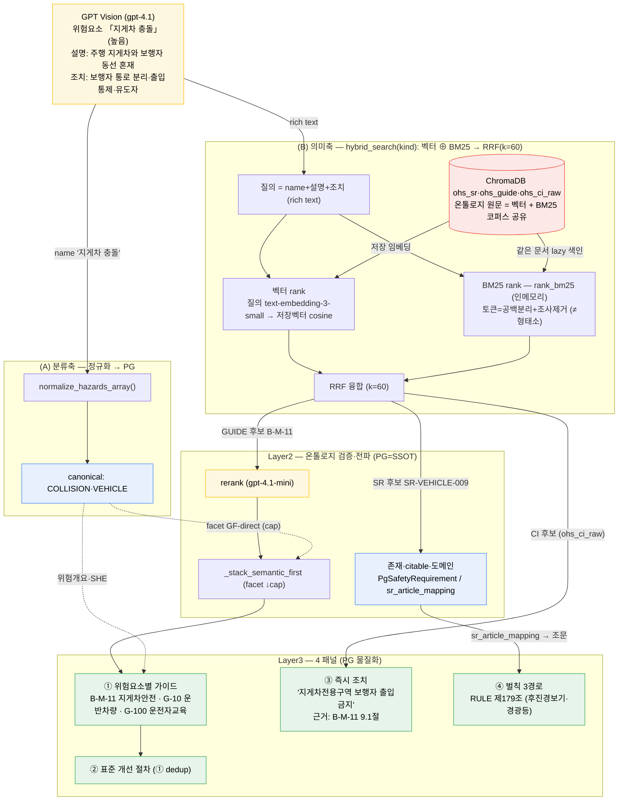
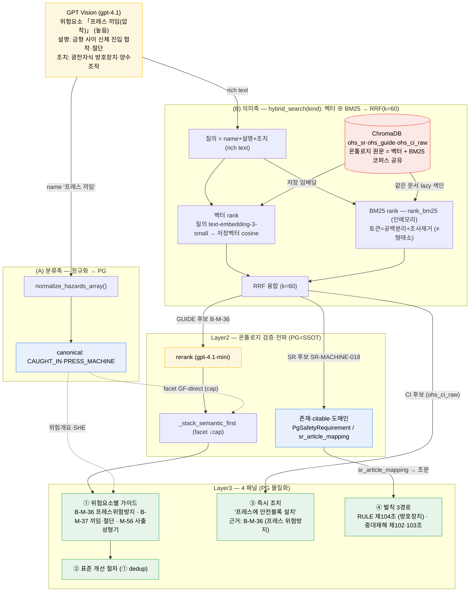

# 런타임 실데이터 흐름 — GPT 인지 문장 → PG(온톨로지) + 벡터DB → 4패널

> v5(semantic attach) 적용 후, "GPT가 인지한 실제 문장"이 어느 아키텍처 노드를 거쳐
> 4패널 결과가 되는지를 **라이브 트레이스 실제값 + 실제 동작 기준**으로 그린 흐름도. (지게차·프레스 2종)
> 노드값은 `scripts/run_forklift_panels.py` / `test_ci_grounding.py` 출력과 대조 완료.

## 읽는 법 — 두 축
GPT 위험요소 1건이 **두 축**으로 흐른다:
- **(A) 분류축**: `name` → `normalize_hazards_array()` → canonical 코드 → PG `*_canonical`.
  위험개요·SHE 매칭·facet 보조에 쓰임. (구조·분류)
- **(B) 의미축 ⭐**: `name+설명+조치` rich text → **hybrid_search** (벡터 rank ⊕ BM25 rank → RRF) →
  온톨로지 검증 → rerank. SR/GUIDE/CI 부착의 **주 경로**. 종류(SR/GUIDE/CI_raw)별 독립 호출.

**hybrid recall 실제 동작**: 벡터 rank와 BM25 rank는 **같은 ChromaDB 컬렉션의 문서**를 각각 점수화한 뒤
**RRF(k=60)** 로 융합한다. BM25는 별도 ES 서버가 아니라 **`rank_bm25`(BM25Okapi) 인메모리** 이고,
토큰화는 **공백 분리 + 조사(접미사) 제거**(`text_utils.tokenize_korean`) — *형태소 분석(kiwipiepy) 아님*.

## 노드 ↔ 실제 구현체
| 흐름도 노드 | 실제 구현 |
|---|---|
| GPT Vision | `app/integrations/openai_client.py` gpt-4.1 |
| normalize | `hazard_normalizer.normalize_hazards_array()` → PG `*_canonical` |
| 벡터 rank | 질의 `text-embedding-3-small` → ChromaDB 저장벡터 cosine (`_vector_rank`) |
| 벡터DB | ChromaDB `ohs_sr·ohs_ns·ohs_ci·ohs_guide·ohs_ci_raw` (온톨로지 원문 임베딩, `build_kb_embeddings.py`) |
| BM25 rank | **`rank_bm25` BM25Okapi 인메모리** — 토큰=공백+조사제거(`tokenize_korean`, ≠형태소), **ES 없음** |
| 융합 | **RRF k=60** (`hybrid_search.search`) — 벡터·BM25 각 rank 합성 |
| 검증 | PG `PgSafetyRequirement`·`PgKoshaGuide` 존재 / `sr_article_mapping` citable |
| rerank | `_rerank_guides_llm()` gpt-4.1-mini |
| semantic-first | `_stack_semantic_first()` (facet ↓cap) |
| 즉시조치 | `hazard_to_ci_service.match_hazards_to_ci()` → `ohs_ci_raw` → guide+section 인용 |
| 벌칙 | `get_penalty_candidates(sr_ids)` → `sr_article_mapping` → 조문 |

---

## ① 지게차 (물류창고) — 실제 트레이스

## ② 프레스 (제조) — 실제 트레이스

## 핵심 한 줄
GPT 자유서술 조치(`보행자 통로 분리` / `광전자식 방호장치`) → **hybrid(벡터⊕BM25) 회수** → 우리 권위
CI·GUIDE·SR에 grounding → 섹션·조문 인용까지. 분류축(코드)은 위험개요·SHE·facet 보조로만,
부착 정밀도는 의미축(벡터DB+BM25 RRF)+온톨로지 검증이 책임진다.

## 정정 이력
- BM25를 초기 흐름도에서 "kiwipiepy"로 표기했으나, 실제 토큰화는 **공백+조사제거**(`tokenize_korean`)이며
  엔진은 **`rank_bm25` 인메모리**(ES 아님). 본 문서는 실제 동작 기준으로 수정됨.
