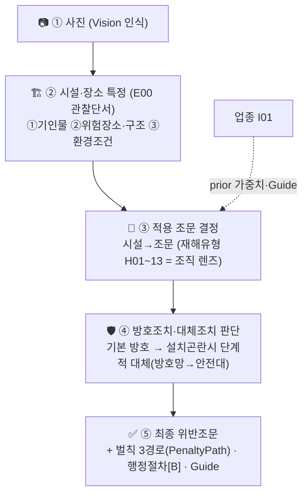

# 감독관 판단기준 — 마스터 (산업안전보건규칙)

> **지식 SSOT**. 이 디렉토리는 사진→조문 매핑의 ④ `expert_modules.py`(코드)·⑤ `DecisionPath`/SWRL(온톨로지)이
> **파생되는 단일 원천**이다. 고치면 ④/⑤를 재생성한다.
>
> **모델: 시설·장소(관찰단서) → 조문 (AI 산업안전감독관).** ★**시설 특정이 1차 축** — 실제 감독관은 현장에서 **시설·장소를 먼저 특정**한 뒤 그에 따른 **재해유형·조문·방호조치**를 검토한다(감독관 검수, `방호조치 대체 관련.pdf`). **재해유형을 먼저 분류하지 않는다.**
> 입구 = 사진에서 보이는 **관찰단서 3종** ① 기인물(물건·설비) · ② 위험장소·구조(개구부·계단·지붕…) · ③ 환경조건(어두운 조명·미끄러운 바닥·소음·고온…). 입구 인덱스 = [E00 관찰단서 카탈로그](E00-관찰단서카탈로그.md).
> 감독관 추론 골격(5단계): **① 사진 → ② 시설·장소 특정 → ③ 적용 조문 결정 → ④ 방호조치·대체조치 → ⑤ 최종 위반조문** (+ 벌칙·행정절차·Guide).
> 재해형태 `H01~13` = **시설에서 파생되는 렌즈**(계단→추락, 지게차→끼임·충돌) — 조문 앞 게이트가 아니라 시설→조문을 조직하는 판단흐름. `E`=기인물 상세(차량계 E01). `I`=업종 prior. 한 사진 multi-label → 후보 union → 특이성 순 랭킹.
>
> **Track A/B**: `[A]`=사진 가시(Track A 채점) · `[B]`=서류·절차·측정(Track B 자문, 채점 제외).

## 0. 공통 판단틀 (모든 분야 척추)
```
① 위험작업? → ② 사전조사·작업계획서 [B]제38조 → ③ 지휘자(제39조)·신호(제40조) [B] (유도자는 설비조문 제172조·제344조)
→ ④ 물리적 방호 [A](난간·덮개·방호장치) → ⑤ 곤란시 대체 [A](방호망→안전대)
→ ⑥ 보호구·표지·출입통제 [A/B] → ⑦ 점검·기록 [B]
```
= **계획 → 구조적 방호 → 작업통제 → 개인보호 → 점검·기록.** Track A 핵심은 ④⑤⑥의 가시 상태.

## 1. 마스터 흐름도 (시설·장소 특정 → 조문 → 방호·대체 → 최종위반)

> 감독관 실무 5단계(`방호조치 대체 관련.pdf`). 시설·장소 특정이 먼저이고, 재해유형(H)은 ③에서 시설→조문을 조직하는 렌즈로만 작동(조문 앞 게이트 아님).


> ③④는 §0 공통 판단틀(계획→구조방호→작업통제→개인보호→점검·기록)로 상세화.

## 2. 분야 불문 핵심 원칙
1. **시설·장소 특정이 재해유형 판단보다 먼저** (감독관 실무) → 특정된 시설의 1차조문 (계단=H01 제30조·개구부=제43조·비계=제56조·차량계 하역운반기계 총칙=E01 제171조~제178조, 지게차 전용=제179조~제183조).
2. **"안전난간"은 조건부** — 난간 없음=장소조문(제30조 등)·있으나 구조미달=제13조 (H01 §5.1, 감독관 검수).
3. **"설치 곤란"은 단계적 대체** (작업발판→방호망→안전대, H01).
4. **안전대는 제44조 세트** (부착설비+점검).
5. **절차 조문(제38조·제39조·제40조)은 비가시 = Track B 자문**(채점 제외).
6. **장비는 총칙(제171조~제178조/제199조~제206조) 필터를 세부조문 앞에** (E01).
7. **업종은 prior(가중치·Guide)이지 분류축 아님** (I01).

## 3. SSOT 인덱스 (총 17)

### [E00] 관찰단서 카탈로그 (입구 인덱스) — 1
| 모듈 | 내용 |
|---|---|
| [E00](E00-관찰단서카탈로그.md) | **관찰단서 → 조문** · 98 단서(① 기인물 77 · ② 위험장소·구조 14 · ③ 환경조건 7) 조문 직결. 소스 `cue-pool.json`(편집→`build_cue_catalog.py` 재생성). |

### [H] 재해형태 모듈 (단서 → 사고 맥락화) — 13
| # | 모듈 | 핵심 조문/Guide |
|---|---|---|
| [H01](H01-추락.md) | 추락(떨어짐) | 제42조·제43조·제44조·제13조·제30조·제56조·제68조·제23조·제24조(사다리·가설통로)·제45조 |
| [H02](H02-전도미끄러짐정리정돈.md) | 전도·미끄러짐·정리정돈 | 제3조·제4조·제22조·제23조·제24조 / M-59 |
| [H03](H03-끼임협착회전체.md) | 끼임·협착·회전체 | 제87조·제88조·제89조·제92조·제93조·제130조(식품가공) / 프레스·컨베이어 |
| [H04](H04-절단베임찔림.md) | 절단·베임·찔림 | 제87조·제106조·제122조·제32조 / A-G-5 |
| [H05](H05-낙하비래.md) | 낙하·비래 | 제14조 |
| [H06](H06-붕괴굴착.md) | 붕괴·굴착 | 제338조~제342조·제344조~제347조 (제343조 삭제) |
| [H07](H07-감전.md) | 감전 | 제301조·제302조·제313조·제319조·제321조 |
| [H08](H08-화재폭발파열.md) | 화재·폭발·파열 | 제16조·제225조~제232조·제241조 / D-28 |
| [H09](H09-유해물질분진.md) | 유해물질·분진 | 제4조의2(분진) · 화학 제429조·제450조[A]/측정·MSDS[B] / W-26·H-26 |
| [H10](H10-석면.md) | 석면 해체·제거 | 제489~495 |
| [H11](H11-고온화상.md) | 고온·화상 | 제254조(화상)·제247조~제253조·제32조 / H-26 |
| [H12](H12-질식밀폐공간.md) | 질식·밀폐공간 | 제619조·제619조의2 |
| [H13](H13-근골격계중량물.md) | 근골격계·중량물취급 | 중량물 제38조[B]·제385조 · 근골격 제656조~제666조 / M-59 |

### [E] 기인물(설비) 모듈 — 1
| [E01](E01-차량계양중기장비.md) | 차량계·양중기 장비 | 제38조~제41조 + 총칙 제171조~제178조/제199조~제206조 + 제132조~제150조 + 지게차 제179조~제183조 (부딪힘·전도 포함) |

### [I] 업종 prior 레이어 — 1
| [I01](I01-업종prior.md) | 업종별 prior | 건설·제조·음식점·서비스·농업 → 예상 재해/기인물 + 업종특화 Guide |

## 4. 시설·장소 → 재해유형 렌즈 (시설 특정 後 파생 — 재해유형 먼저 묻지 않음)

> ★시설·장소 특정(E00)이 **먼저**. 아래는 특정된 시설이 어느 재해 렌즈(H/E)로 조직되는지의 역참조표(감독관 실무: 시설→재해유형).

| 특정된 시설·장소 | 재해 렌즈 |
|---|---|
| 계단·개구부·지붕·비계·고소작업대·작업발판끝·**사다리식 통로·가설통로** | **H01** 추락 |
| 젖은/미끄러운 바닥·정리불량 통로 | **H02** 전도·미끄러짐 |
| 회전체·기계 구동부·롤러·교반기 | **H03** 끼임·회전체 |
| 칼날·톱·연삭날·프레스 | **H04** 절단·베임 |
| 상부 적재물·자재 더미 | **H05** 낙하·비래 |
| 굴착면·흙막이·토사·법면 | **H06** 붕괴·굴착 |
| 전기설비·충전부·분전반 | **H07** 감전 / 인화성·화기작업 → **H08** |
| 유해물질·분진·석면·고열·밀폐공간 | **H09~H12** |
| 중량물·인력운반·반복동작 | **H13** 근골격·중량물 |
| 지게차·크레인·굴착기·차량계 | **E01** (충돌·전도·끼임) |
> 업종(음식점·건설…)은 I01 prior로 가중치 보정 + Guide 선택. 한 시설이 복수 렌즈 성립(multi-label).

## 5. 조문 관계 카탈로그 (선후·준용·대체·동반 — ⑤ 파생원천)

> 모듈별 평면 나열이 놓치는 **교차 조문 관계**를 한 곳에 박제. ⑤가 여기서 `DecisionPath`/`DecisionStep`(precedesStep)/`fallbackArticle`/`articlePrecedence`/`coApplicable`/SWRL을 파생하고, ④ `expert_modules.py`는 force-include 체인·rank_hint를 여기서 읽는다. (관계는 H01·E01·H03 등 검증 모듈에서 추출)

### 5.1 안전난간 = 제13조 (조건부 분기 — 감독관 검수 반영)
★**제13조는 단독 사용 금지. "난간 존재 여부"로 분기**(감독관 `방호조치 대체 관련.pdf`):
- 계단(1m↑ 개방측)에 **난간 없음** → **제30조** 위반(설치 의무). ← 제13조 아님.
- 계단(1m↑ 개방측)에 **난간 있으나 구조기준 미충족** → **제13조** 위반(상부·중간난간대·발끝막이판10cm↑·난간기둥·100kg 강도).
- 난간 있고 구조 충족 → 위반 없음.
- **동일 패턴 일반화**: 제43조(개구부)·제56조(비계)·제68조(이동식비계 최상부)도 — 난간 **없음**=그 장소조문(미설치), 난간 **있으나 구조미달**=제13조.
- ⑤ `DecisionStep`: 조건(난간 존재?) → 분기(미설치=장소조문 / 구조미달=제13조). ④ 후보엔 둘 다 넣되(recall 천장), **판정은 분기**로 택일. 제13조는 절대 단독 1차 아님(난간 존재가 전제).

### 5.2 단계적 대체 체인 — 곤란시 fallback
- **제42조**: 작업발판(1차) → (설치곤란) 추락방호망(2차) → (곤란) 안전대(3차) → **제44조**(안전대 부착설비·작업 전 점검).
- **제43조**: 난간등·덮개(1차) → (곤란·임시해체) 제42조 추락방호망 → 안전대 → 제44조.
- ⑤ `DecisionStep precedesStep`(단계 순서) + `fallbackArticle`(곤란시 다음 단계). 채점은 사진에 보이는 단계의 조문.

### 5.3 총칙 → 세부 — 장비 공통필터 (E01)
- 제171조~제178조(차량계 하역운반기계 총칙) → 제179조~제183조(지게차 세부).
- 제199조~제206조(차량계 건설기계 총칙) → 굴착기·로더 등 세부.
- 제132조~제150조(양중기·크레인) → 이동식 제147조~제150조.
- ⑤ `requiresGeneral`/`precedesStep`(총칙이 세부보다 먼저). ④ 장비군 식별 → 총칙 force-include 후 세부.

### 5.4 동형 대응 — 장비군 전환 (하역운반 ↔ 건설기계)
제171조↔제199조(전도) · 제172조↔제200조(접촉) · 제175조↔제202조(탑승)·제204조(주용도외) · 제178조↔제203조(하중) · 제176조↔제205조·제206조(정비). ⑤ `sameRiskPattern`.

### 5.5 동반 발생 — co-occur
- 추락(제42조·제43조·제56조·제68조) + **제14조(낙하물)**: 작업발판·상부에 자재 → 추락·낙하 동시 성립.
- ⑤ `coApplicable`. ④ 두 모듈 hint 누적.

### 5.6 끼임 일반 → 세부 + 정비 공통
- 일반 **제87조**(원동기·회전축) → 세부 specialize: 제103조(프레스)·제130조(식품가공)·제121조(사출)·제122조(연삭)·제191조~제195조(컨베이어).
- 정비·청소 공통: **제92조**(운전정지·LOTO)·**제93조**(방호장치 해체금지) — 전 동력기계 정비 단서에서 force-include.
- ⑤ `specializes`(세부⊑일반) + `appliesToAllMachinery`(제92조·제93조).

## 6. 사고유형별 1차조문 + 전역 강등 (랭킹 — ④ rank_hint)

> 랭킹 miss(포괄조항이 특정조문 위)가 실패의 ~절반. 각 intent의 **1차조문**을 force-include 최상위로, **포괄조항은 전역 강등**.

### 6.1 intent·장소 → 1차조문
| intent·장소 | 1차조문 | 보강 |
|---|---|---|
| 추락-계단(1m↑) | 난간없음 **제30조** / 난간있고 구조미달 **제13조** (조건부·배타) | 계단참 개구부면 +제43조 |
| 추락-개구부/통로끝 | **제43조** | +제13조 / 제42조(대체) |
| 추락-비계 작업발판 | **제56조** | +제13조 |
| 추락-이동식비계 | **제68조** | +제13조 |
| 추락-일반 고소 | **제42조** | +제44조(안전대) |
| 추락-사다리식 통로 | **제24조**(폭30cm·미끄러짐·상단60cm·기울기75도) | 이동식 사다리 작업 별도 |
| 추락-가설통로·경사로 | **제23조**(경사30도·미끄럼방지·난간) | +제13조(난간 구조) |
| 추락-지붕 | **제45조** | +제42조(대체) |
| 낙하물 | **제14조** | +**제20조**(위험구역 출입금지) |
| 끼임-일반 회전체 | **제87조** | +제92조·제93조 |
| 끼임-식품가공(음식점) | **제130조** | +제87조 |
| 끼임-프레스/컨베이어/사출/연삭 | **제103조/제191조~제195조/제121조/제122조** | +제87조 |
| 절단-동력날 | **제87조·제106조** | +제122조·제93조 |
| 굴착·붕괴 | **제340조** | +제338조·제345조~제347조 |
| 감전-정전가능 | **제319조** | +제301조·제302조 |
| 감전-충전전로 | **제321조** | — |
| 화재·폭발 | **제241조**(화기작업)/**제16조**(보관) | +제225조·제230조~제232조 |
| 석면 | **제495조**(밀폐·음압·습식)/**제490조**(표지) | +제491조·제492조 |
| 고온화상-산업 | **제254조** | +제32조 |
| 장비-접촉/충돌 | **제172조**(하역)/**제200조**(건설) | +총칙 |
| 장비-전도 | **제171조**(하역)/**제199조**(건설) | +총칙 |

### 6.2 전역 강등 (suppress — 다른 특정조문 있으면 하위)
- **제3조(전도)·제4조(청결)·제22조(통로)**: 포괄성 높아 거의 모든 현장 성립 → 특정조문 존재 시 강등. 단독 명확한 정리불량/전도일 때만 상위.
- **제32조(보호구)**: 보조 조문 — 1차조문 뒤 보강으로만.
- **절차조문(제38조·제39조·제40조)**: [B] 비가시 → Track A 채점 제외(Track B 자문).
