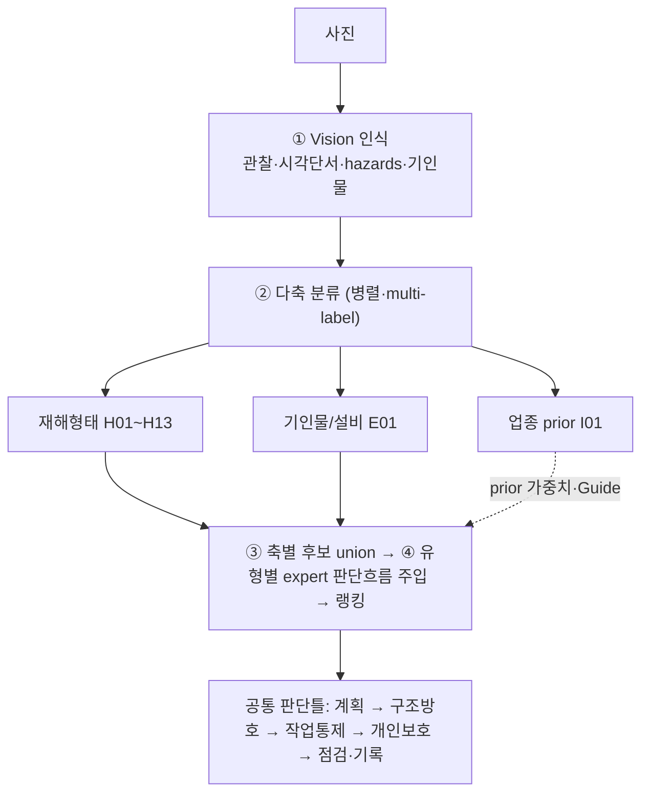

# 감독관 판단기준 — 마스터 (산업안전보건규칙)

> **지식 SSOT**. 이 디렉토리의 흐름도는 사진→조문 매핑 파이프라인의 ④ `expert_modules.py`(코드)와
> ⑤ `DecisionPath`/SWRL(온톨로지)이 **파생되는 단일 원천**이다. 흐름도를 고치면 ④/⑤를 재생성한다.
>
> **다축(faceted) 설계** — 업종 계층이 아니라 직교 다축 병렬 분류:
> `H`=재해형태(주축, 조문 매핑) · `E`=기인물/설비(주축) · `I`=업종(prior·Guide 라우팅, 분류축 아님).
> 한 사진은 여러 축에 동시 매칭(multi-label) → 축별 후보 union → 특이성 순 랭킹.
>
> **Track A/B**: `[A]`=사진 가시(Track A 채점) · `[B]`=서류·절차·측정(Track B 자문, 채점 제외).

## 0. 공통 판단틀 (모든 분야 척추)
```
① 위험작업? → ② 사전조사·작업계획서 [B]제38조 → ③ 지휘자(제39조)·신호(제40조) [B] (유도자는 설비조문 제172조·제344조)
→ ④ 물리적 방호 [A](난간·덮개·방호장치) → ⑤ 곤란시 대체 [A](방호망→안전대)
→ ⑥ 보호구·표지·출입통제 [A/B] → ⑦ 점검·기록 [B]
```
= **계획 → 구조적 방호 → 작업통제 → 개인보호 → 점검·기록.** Track A 핵심은 ④⑤⑥의 가시 상태.

## 1. 마스터 흐름도 (다축)


## 2. 분야 불문 핵심 원칙
1. **장소/설비 특정 조문 먼저** (계단=H01 제30조·개구부=제43조·비계=제56조·차량계 하역운반기계 총칙=E01 제171조~제178조, 지게차 전용=제179조~제183조).
2. **"안전난간"은 제13조 구조기준으로** 판단(H01).
3. **"설치 곤란"은 단계적 대체** (작업발판→방호망→안전대, H01).
4. **안전대는 제44조 세트** (부착설비+점검).
5. **절차 조문(제38·39·40)은 비가시 = Track B 자문**(채점 제외).
6. **장비는 총칙(제171~178/199~206) 필터를 세부조문 앞에** (E01).
7. **업종은 prior(가중치·Guide)이지 분류축 아님** (I01).

## 3. SSOT 인덱스 (총 16)

### [H] 재해형태 모듈 (사진 가시 위험) — 13
| # | 모듈 | 핵심 조문/Guide |
|---|---|---|
| [H01](H01-추락.md) | 추락(떨어짐) | 제42·43·44·13·30·56·68 |
| [H02](H02-전도미끄러짐정리정돈.md) | 전도·미끄러짐·정리정돈 | 제3·4·22·23·24 / M-59 |
| [H03](H03-끼임협착회전체.md) | 끼임·협착·회전체 | 제87·88·89·92·93 / 프레스·컨베이어·식품가공 |
| [H04](H04-절단베임찔림.md) | 절단·베임·찔림 | 제87·122·32 / A-G-5 |
| [H05](H05-낙하비래.md) | 낙하·비래 | 제14 |
| [H06](H06-붕괴굴착.md) | 붕괴·굴착 | 제338조~제342조·제344조~제347조 (제343조 삭제) |
| [H07](H07-감전.md) | 감전 | 제301·302·313·319·321 |
| [H08](H08-화재폭발파열.md) | 화재·폭발·파열 | 제16·225~232·241 / D-28 |
| [H09](H09-유해물질분진.md) | 유해물질·분진 | 제4의2·화학노출 / W-26·H-26 |
| [H10](H10-석면.md) | 석면 해체·제거 | 제489~495 |
| [H11](H11-고온화상.md) | 고온·화상 | 용융고열물 절·제32 / H-26 |
| [H12](H12-질식밀폐공간.md) | 질식·밀폐공간 | 제619·619의2 |
| [H13](H13-근골격계중량물.md) | 근골격계·중량물취급 | 중량물 제38조[B]·제385조 · 근골격 제656조~제666조 / M-59 |

### [E] 기인물(설비) 모듈 — 1
| [E01](E01-차량계양중기장비.md) | 차량계·양중기 장비 | 제38~41 + 총칙 171~178/199~206 + 132~150 + 지게차 179~183 (부딪힘·전도 포함) |

### [I] 업종 prior 레이어 — 1
| [I01](I01-업종prior.md) | 업종별 prior | 건설·제조·음식점·서비스·농업 → 예상 재해/기인물 + 업종특화 Guide |

## 4. 사진 판정 8문 (intent 분류 가이드)
1. 사람이 떨어질 위험? → H01
2. 미끄러지거나 넘어질 위험? → H02
3. 기계·회전체에 끼일 위험? → H03
4. 칼·날에 베일 위험? → H04
5. 물체가 떨어질 위험? → H05
6. 토사·구조물 무너질 위험? → H06
7. 감전 위험? → H07 / 불·폭발? → H08
8. 유해물질·분진·석면·고온·질식? → H09~H12
9. 무리한 동작·중량물? → H13
10. 차량·장비 충돌·전도? → E01
> 업종(음식점·건설…)은 I01 prior로 위 가중치 보정 + Guide 선택. 복수 동시 성립(multi-label).
