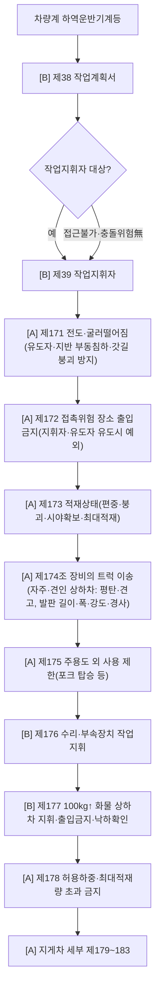
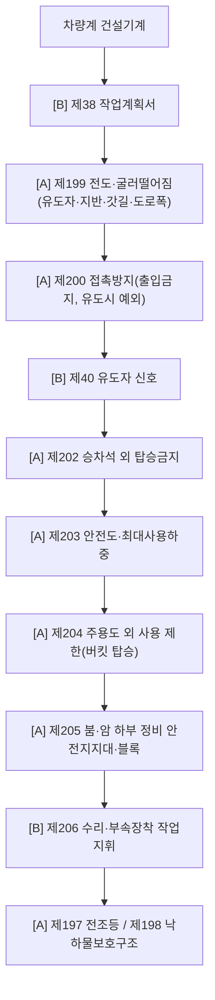
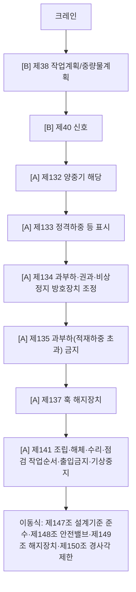

# 차량계·양중기 장비 감독관 판단기준 (기인물축)

> 기인물(설비) 모듈. **핵심 교정**: 차량계 하역운반기계는 장비별 세부조문(지게차 제179~183) 직행이 아니라
> **제171~178조 총칙을 중간 "공통 필터"로 먼저 통과**시킨다. 부딪힘·전도도 여기서 다룸.
> `[A]`=가시(Track A 채점) · `[B]`=절차(Track B 자문, 채점 제외).

## 판단 순서 (수정안)
```
① [B] 제38: 작업계획서 대상 확인
→ ② [B] 제39: 작업지휘자 지정 대상 확인
→ ③ 장비군별 총칙 필터
    · 차량계 하역운반기계등: 제171~178
    · 차량계 건설기계: 제196~206
    · 양중기/크레인: 제132~150
→ ④ [B] 제40: 신호·유도 체계 확인
→ ⑤ 장비별 세부조문 (지게차 제179~183 / 고소작업대 제186 …)
→ ⑥ 사고유형별 추가 (추락·낙하물·감전·굴착붕괴)
```

## A. 차량계 하역운반기계등 (지게차·구내운반차·화물자동차·고소작업대)

**총칙 제171~178 역할(필터)**: 제171 전도(경사·갓길·굴착부·지반침하·상하차 전도) · 제172 접촉(작업반경 내 통행·후진 무유도·동선 미분리) · 제173 적재(고적재·편중·시야가림·고정無) · 제174 트럭 상하차 발판 · 제175 포크 탑승/발판 사용 · 제176 정비 끼임 · 제177 화물차 상하차 낙하·협착 · 제178 과적·하중중심 이탈.

**지게차 세부**: 제179 전조등·후미등·후방확인 · 제180 헤드가드 · 제181 백레스트 · 제182 팔레트·스키드 · 제183 좌석안전띠. (전부 `[A]`)

## B. 차량계 건설기계 (굴착기·로더·덤프·롤러)


## C. 양중기·크레인


## 하역운반기계 ↔ 건설기계 대응표
| 위험유형 | 차량계 하역운반기계 | 차량계 건설기계 |
|---|---|---|
| 전도·굴러떨어짐 | 제171 | 제199 |
| 접촉·충돌 | 제172 | 제200 |
| 승차석 외 탑승 | 제175(주용도) | 제202 |
| 안전도·하중 | 제178 | 제203 |
| 주용도 외 사용 | 제175 | 제204 |
| 수리·정비 | 제176 | 제205·206 |

## 사진 판정 문구 예
- 지게차 작업반경 내 근로자 → 주 `[A]`제172(접촉 출입금지) · `[B]`제38·39 · 유도시 `[B]`제40 · `[A]`제179 후방확인.
- 지게차 경사지·굴착부 운행 → 주 `[A]`제171(전도·지반·갓길) · `[A]`제178 허용하중 · `[A]`제183 안전띠.
- 화물차에 장비 싣고내림(자주·견인) → `[A]`제174조(이송 발판) · 일반 화물 상하차 → `[B]`제177조(100kg 지휘)·`[A]`제173조(적재·낙하).
- 굴착기 후진 → `[A]`제200 · 유도시 `[B]`제40 · `[A]`제202 탑승금지.
- 굴착기 붐 밑 정비 → `[A]`제205 안전지지대 · `[B]`제206 지휘.

## expert 모듈 규칙 (④ 파생용)
- 기인물 단서로 장비군 식별 → 해당 **총칙 force-include**(하역운반=제171~178 / 건설기계=제199~206 / 크레인=제132~150 중 `[A]`) **후** 장비별 세부(제179~183 등).
- 사람-장비 동선/작업반경 단서 → **제172(또는 제200) 최상위** + 유도자 보이면 제40(자문).
- 경사·갓길·굴착부 단서 → 제171(또는 제199) 최상위.
- 절차조문(제38·39·40·176·177·206) = `[B]` force-include하되 **Track A 채점 제외**(Track B 자문 출력에만).
- rank_hint: "총칙 접촉/전도(제171·172 / 제199·200)를 장비별 세부보다 먼저, 절차조문은 가시조문 아래로."
