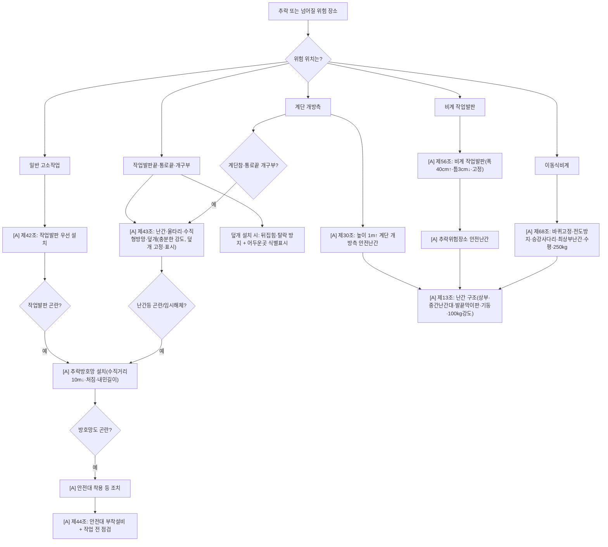

# 추락재해 감독관 판단기준

> 재해유형 `FALL`. gold의 ~64%가 이 클러스터(제43:39·제13:15·제42:6·제56:8·제30:5·제68:5·제44·제45). Track A 최대 레버.
> `[A]`=가시(채점) · `[B]`=절차(자문).

## 핵심 구조
```
① 추락위험 장소인가?
→ ② 작업발판·계단·통로·개구부·비계 등 위험유형 특정
→ ③ 시설별 1차 방호조치 적용
→ ④ 설치 곤란/임시해체 시 대체조치 (방호망→안전대)
→ ⑤ 안전대 사용 시 부착설비+사전점검 (제44)
```

## 전체 흐름도


## 조문별 선후관계
- **제42조 [A·partial]** 일반 추락 — 작업발판 우선 → 곤란시 추락방호망(수직거리 10m↓·수평·처짐·내민길이) → 곤란시 안전대 → **제44조**로 연결.
- **제43조 [A·yes]** 개구부·통로끝·작업발판끝 — 난간·울타리·수직형방망·덮개(충분한 강도). 덮개는 뒤집힘·탈락 방지 + 식별표시. 설치곤란/임시해체 시 제42 방호망 → 안전대. (제42보다 장소특정형)
- **제44조 [A·partial]** 안전대는 끝이 아님 — 높이 2m↑서 안전대 착용 시 부착설비 설치 + 지지로프 처짐·풀림 방지 + 작업 전 점검(이상시 보수·교체).
- **제13조 [A·partial]** 안전난간 구조기준 — 다른 조문이 "안전난간 설치"를 요구하면(제30·43·56·68) 그 난간이 상부·중간난간대·발끝막이판10cm↑·난간기둥·100kg 강도 충족하는지 여기서 판단.
- **제30조 [A·yes]** 높이 1m↑ 계단 개방측 안전난간 → 구조는 제13.
- **제56조 [A·partial]** 비계 작업발판(폭·틈·고정·견고성·안전난간) → 난간 구조 제13. "아시바 1줄만" = 제56 난간 미흡 + 제13.
- **제68조 [A·partial]** 이동식비계(바퀴 브레이크·전도방지·승강사다리·최상부 난간·수평·250kg).
- **제45조 [A·yes]** 지붕 위 작업 위험 방지.

## 적용순서 (사진 유형별)
- **계단**: 1m↑ 개방측 → 제30 → (난간 허술) 제13 → (계단참·통로끝 개구부) 제43.
- **개구부/통로끝**: 제43 → (덮개) 고정+표시 / (난간) 제13 / (곤란·임시해체) 제42 방호망 → 안전대 제44.
- **비계 작업발판**: 제56(발판 기준) → 추락위험장소 난간 → 제13 구조 → (자재낙하 동반) 제14.
- **이동식비계**: 제68 → 최상부 난간 제13 → (적재) 250kg / (자재낙하) 제14.

## 실무 판단 문구 예
- 개구부 방호덮개 고정 불량 및 식별표시 미흡 → 주 **제43**, 난간이면 **제13**, 곤란·임시해체 시 **제42/44**.
- 비계 외측 아시바 1줄 → 주 **제56**, 난간구조 **제13**, 자재낙하 **제14**.
- 계단 1m↑ 개방측 난간 없음 → 주 **제30**, 구조 **제13**, 계단참 개구부면 **제43**.

## expert 모듈 규칙 (④ 파생용)
- force-include: 장소단서→해당 1차조문(계단=30·개구부/통로끝=43·비계발판=56·이동식비계=68·일반고소=42).
- "안전난간" 단서 → 제13 force-include + 1차조문과 묶어 상위.
- 안전대 단서 → 제44 force-include.
- 낙하물 동반(intent FALLING_OBJECT) → 제14.
- rank_hint: "장소특정 1차조문 + 그 난간의 제13 구조기준을 포괄조항(제3·제22)보다 위로."
