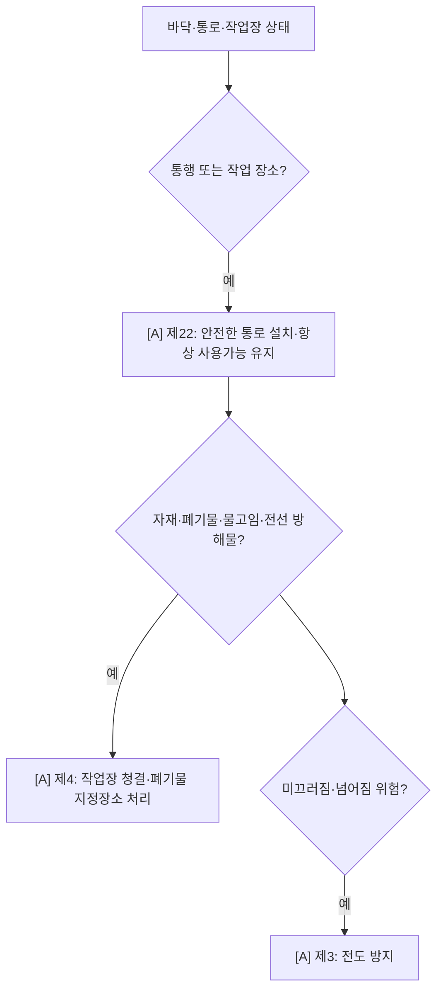

# 통로·정리정돈·전도 감독관 판단기준

> 작업 `HOUSEKEEPING`/전도 `FALL_ON_GROUND`. 현장 사진 판정에서 가장 자주 쓰는 기본 프레임. `[A]`가시.

- **제3 [A·yes]** 전도 방지 · **제4 [A·yes]** 작업장 청결 · **제22 [A·yes]** 안전한 통로.
- 활용: 전선 방치, 물 고임, 자재 적치, 폐기물 방치, 통로 협소.

## 실무 문구
통로상 적치물·전선 방치·물고임 → 통로 `[A]`제22 · 청결 `[A]`제4 · 전도 `[A]`제3.

## expert 규칙
- intent HOUSEKEEPING/SLIP 또는 단서(적치물·전선·물고임·통로협소·정리불량) → 제3·4·22.
- ⚠️ 이들은 포괄성이 높아(거의 모든 현장 성립) **다른 특정 조문이 있으면 그 아래로** (랭킹 강등). 단독으로 명확한 정리불량/전도일 때만 상위.
