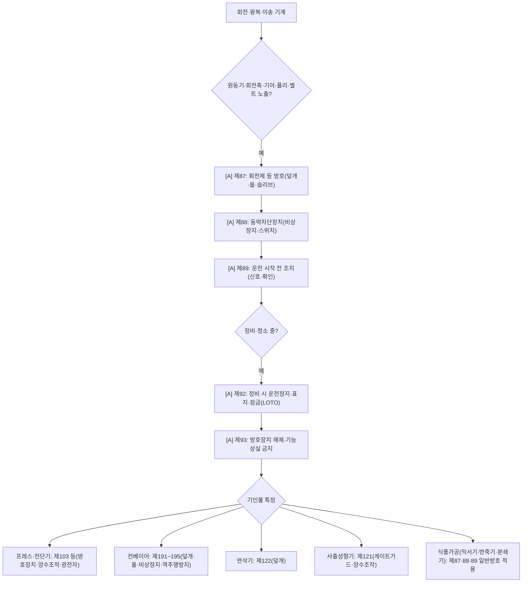

# 끼임·협착·회전체 감독관 판단기준

> 재해형태 `CAUGHT_IN`/`CRUSH`. 제조·음식점 공통 핵심(프레스·믹서기·반죽기·분쇄기·컨베이어·롤러·식품가공기계). 건설 편중 탈피의 핵심 모듈. `[A]`가시.

- **제87 [A]** 원동기·회전축·기어·풀리·플라이휠·벨트 등 위험부위 방호(덮개·울·슬리브·건널다리). **믹서기·반죽기 회전부 노출이 여기.**
- **제88 [A]** 동력차단장치(스위치·클러치·벨트이동장치) 접근 가능 위치.
- **제89 [A]** 운전 시작 전 신호·확인.
- **제92 [A]** 정비·청소·검사 시 운전정지 + 기동장치 잠금·표지(LOTO).
- **제93 [A]** 방호장치 해체·기능상실 금지.
- 기인물별: 프레스 제103, 컨베이어 제191~195, 연삭기 제122, 사출성형기 제121. (기존 gimulmul 라우팅으로도 진입)

## 실무 문구
- 믹서기·반죽기 회전부 덮개 없음 → 주 `[A]`제87 · 동력차단 `[A]`제88 · 정비중이면 `[A]`제92.
- 컨베이어 덮개 해체 → `[A]`제191~195 + 제87.
- 프레스 방호장치 무효화 → `[A]`제103 + 제93.

## expert 규칙 (④ 파생용)
- intent CAUGHT_IN/CRUSH 또는 단서(회전체·기어·벨트·롤러·끼임점) → 제87·88·89·92·93 force-include.
- 기인물(프레스/컨베이어/연삭기/사출/믹서기) 식별 시 해당 세부조문 추가 + 상위.
- ⚠️ 영세 음식점 믹서기도 동일(업종 무관) → I01-업종prior가 음식점→이 모듈 활성.
