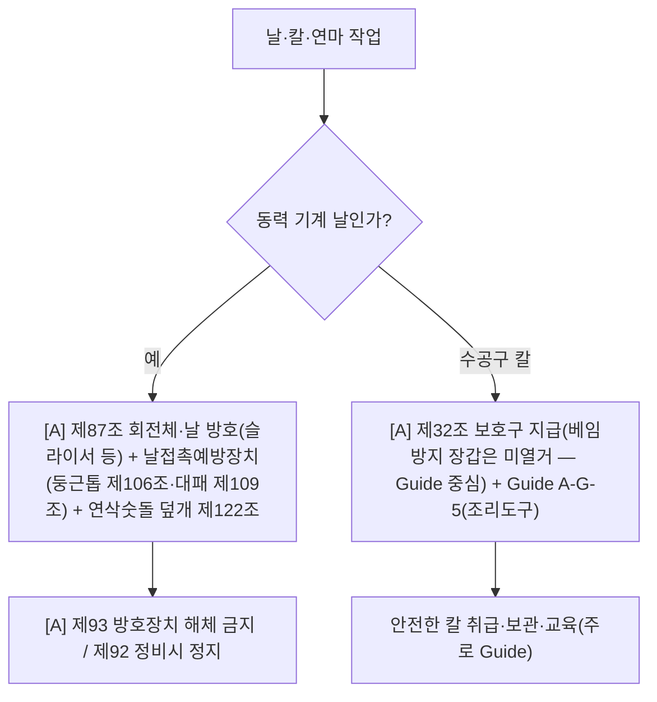

# 절단·베임·찔림 감독관 판단기준

> 재해형태 `CUT`. 음식점(칼·슬라이서)·제조(회전날·연삭). 동력기계 날은 방호로, 수공구 칼은 보호구·Guide로. `[A]`가시(일부 Guide 의존).

- **동력 날**(둥근톱·대패·슬라이서·연삭기): `[A]`제87조(회전체)·제122조(연삭숫돌 덮개)·둥근톱 반발예방 제105조·날접촉예방 제106조(둥근톱)·제109조(대패)·제93조(방호장치 해체금지).
- **수공구 칼**(조리·포장): 산안규칙 직접 조문 **얇음** → `[A]`제32 보호구 + **Guide A-G-5(조리작업장 조리도구 사용)** 이 실질 지식. (※ 정직: 순수 칼질은 정답 조문이 빈약 — Guide 중심.)

## 실무 문구
- 슬라이서·절단기 날 노출 → `[A]`제87·제122 + 제93.
- 조리 칼 베임(보호구 미착용) → `[A]`제32 + Guide A-G-5.

## expert 규칙
- intent CUT/LACERATION 또는 단서(칼·날·슬라이서·연삭) → 동력이면 제87·122·93 force-include; 수공구면 제32 + Guide A-G-5.
- ⚠️ 회전날은 H03(끼임·회전체)와 겹침 → union(faceted) 정상. KOSHA 재해형태가 끼임/절단 구분하므로 모듈 분리 유지.
