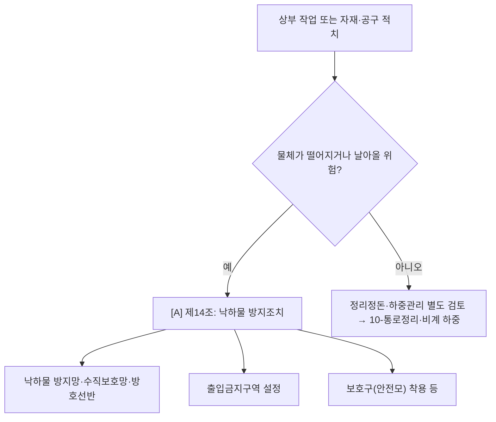

# 낙하물 감독관 판단기준

> 재해유형 `FALLING_OBJECT`. 추락과 함께 보되 적용 포인트가 다름(사람이 떨어짐=추락 / 물체가 떨어짐=낙하). `[A]`가시.

- **제14조 [A]** 작업·통행으로 물체 낙하·비래 위험 시 방지망·수직보호망·방호선반 설치, 출입금지구역, 보호구.
- 비계 작업발판 위 자재 낙하 동반 → 추락(01)·비계(제56·68)와 함께.

## expert 규칙
- intent FALLING_OBJECT 또는 단서(상부작업·자재적치·안전모) → 제14 force-include.
- 추락과 co-occur 흔함 → 두 모듈 hint 누적.
