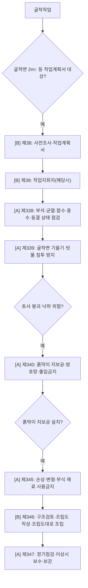

# 굴착·흙막이·토사붕괴 감독관 판단기준

> 재해유형 `COLLAPSE`(굴착). 사전조사 → 굴착면 관리 → 붕괴방지 → 흙막이 지보공 구조·점검.

- **제338 [A]** 부석·균열·함수·용수·동결 점검 · **제339 [A]** 기울기·빗물 · **제340 [A]** 흙막이·방호망·출입금지 · **제345 [A]** 재료 · **제346 [B]** 조립도 · **제347 [A]** 점검.

## 실무 문구
굴착부 토사 붕괴·낙하 방지조치 미흡 → 사전조사 `[B]`제38 · 굴착면 `[A]`제338 · 붕괴방지 `[A]`제340 · 흙막이면 `[A]`제345~347.

## expert 규칙
- intent COLLAPSE/EXCAVATION 또는 단서(굴착면·흙막이·토류판) → 제340·338·345·347 force-include. 제38/346=`[B]` 자문.
