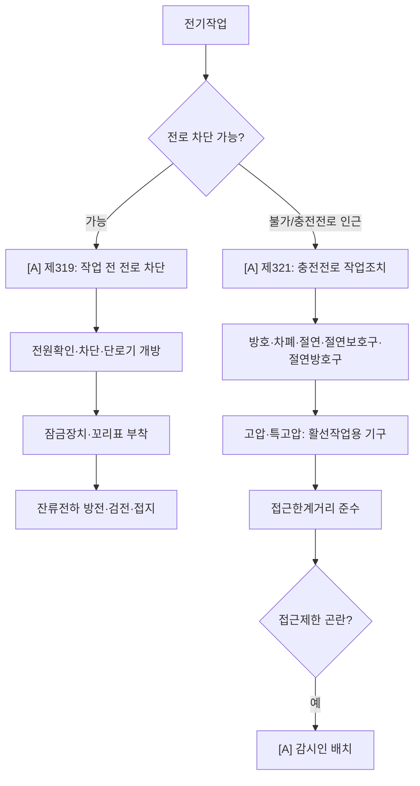

# 전기작업·감전 감독관 판단기준

> 재해유형 `ELECTRIC_SHOCK`. 정전 우선 → 정전 절차 → (불가시) 충전전로 절연·방호·접근한계 → 감시인.

- **제319 [A/B]** 정전 전로차단 절차(차단·잠금·꼬리표·검전·접지 — 일부 가시) · **제302 [A]** 접지 · **제301 [A]** 충전부 방호 · **제313 [A]** 배선 절연피복 · **제321 [A]** 충전전로 작업 절연·방호·접근한계·감시인.
- **제303조 [A]** 전기기계·기구의 적정설치(감독관 gold 실측) — 사용 목적·장소(습기·분진)에 적정한 것 설치, **파손·변형된 전기기구 사용 상태**. 파손 콘센트·소켓·개폐기 단서.
- **제316조 [A]** 꽂음접속기 — 젖은 손 접속 금지·**서로 다른 전압 접속기 혼용 방지 구조**·습윤 장소 방수형. 문어발·물기 근처 콘센트 단서.

## 실무 문구
충전전로 인근 작업 감전방지 미흡 → 정전가능 `[A]`제319 · 충전전로 `[A]`제321(절연·접근한계) · 제한곤란시 감시인.
접지불량/노출 충전부/손상 배선 → `[A]`제301·302·313. 파손된 콘센트·개폐기 → `[A]`**제303조**. 습윤 장소 콘센트·문어발 → `[A]`**제316조**.

## expert 규칙
- intent ELECTRIC_SHOCK 또는 단서(노출 전선·분전함·접지·누전·충전부) → 제301·302·313·319·321 force-include.
- 파손 전기기구 → **제303조** · 콘센트/꽂음접속기(습윤·혼용) → **제316조** force-include.
