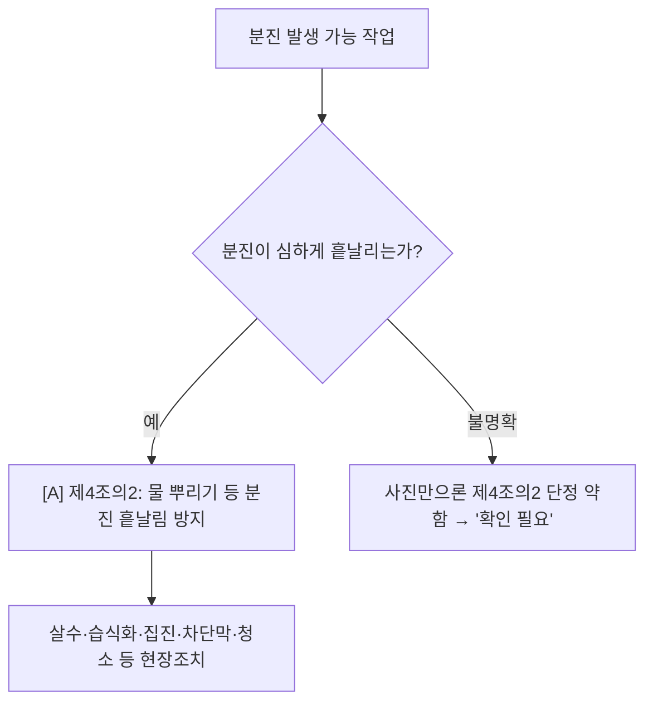

# 분진·비산 감독관 판단기준

> 작업 `DUST`. 분진 발생 작업인가 → 심하게 흩날리는가 → 살수·집진·차단 비산방지가 있는가. `[A]`가시(단 비산 명확성 주의).

- **제4조의2 [A·partial]** 분진 심하게 흩날리는 작업장 → 살수 등 비산방지.

## 실무 문구
절단·연마·토사 취급 중 분진 비산방지 미흡 → 주 `[A]`제4의2. 단 사진상 비산 불명확하면 "확인 필요"로 기재(과대추론 금지).

## expert 규칙
- intent DUST 또는 단서(연삭·절단 분진·토사·살수 미실시) → 제4의2. 비산 시각근거 약하면 maybe(과대추론 금지).
