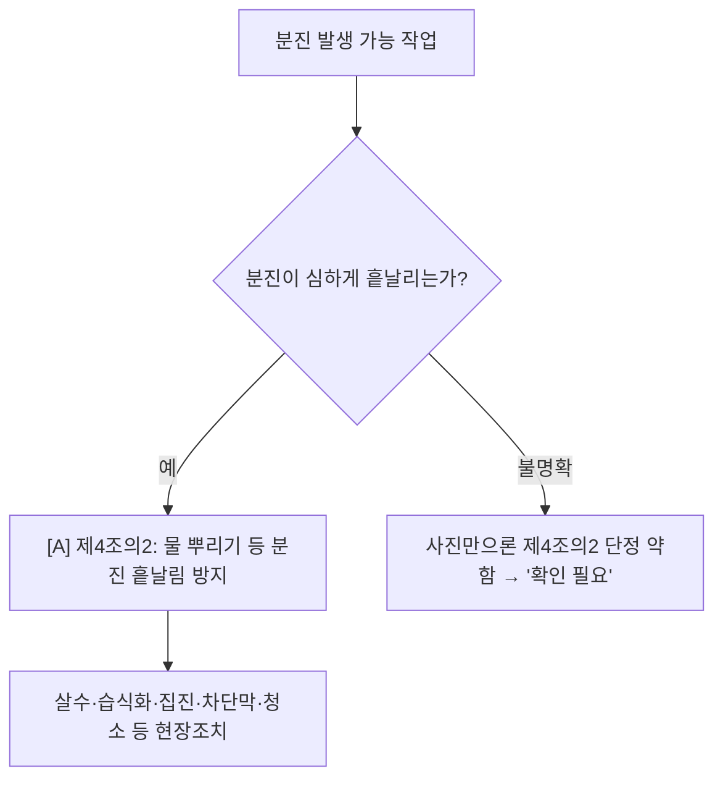

# 유해물질·분진 감독관 판단기준

> 작업 `DUST`/`CHEMICAL`. **두 갈래**: ① 분진 비산(제4조의2, `[A]` 가시) · ② 화학물질 노출(보건기준 관리대상 유해물질, 대부분 `[B]` 측정·관리). 분진 비산만 사진 채점 핵심, 화학노출은 가시 단서(국소배기·보호구)만 `[A]`.

- **제4조의2 [A·partial]** 분진 심하게 흩날리는 작업장 → 살수 등 비산방지.
- **화학물질 노출**(관리대상 유해물질, 편3 보건기준 장1): 위반 핵심(노출농도·작업환경측정·MSDS·특수건강진단)은 **사진 비가시 = [B] 자문**. 가시 단서만 [A]: 국소배기장치 성능·설치(제429조·제425조)·작업장 바닥(제431조)·**호흡용 보호구/방독마스크 지급·착용(제450조·제469조)**. (정직: 사진만으론 물질·농도 단정 불가 → 화학 과대추론 금지.)

## 실무 문구
절단·연마·토사 취급 중 분진 비산방지 미흡 → 주 `[A]`제4조의2. 단 사진상 비산 불명확하면 "확인 필요"로 기재(과대추론 금지).
약품·도장·도금 등 화학 취급장 → 가시면 `[A]`국소배기 제429조·제425조 / 호흡보호구 제450조·제469조; 노출·측정·MSDS는 `[B]` 자문.

## expert 규칙
- intent DUST 또는 단서(연삭·절단 분진·토사·살수 미실시) → 제4조의2. 비산 시각근거 약하면 maybe(과대추론 금지).
- intent CHEMICAL 또는 단서(약품용기·국소배기 후드·방독마스크·도장·도금) → 가시면 국소배기 제429조·제425조 / 보호구 제450조·제469조([A]); 노출·측정·MSDS는 [B] 자문(과대추론 금지).
