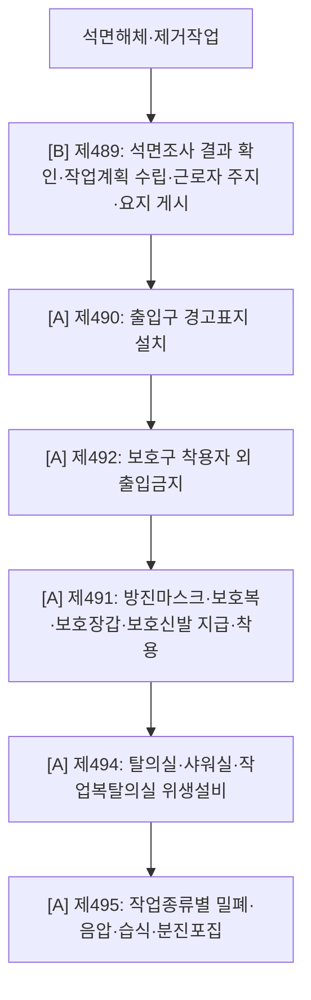

# 석면해체·제거 감독관 판단기준

> 재해유형/작업 `ASBESTOS`. 석면조사 확인 → 작업계획 → 경고표지·출입통제 → 보호구 → 위생설비 → 밀폐·음압·습식·폐기.

- **제489 [B]** 조사·계획 · **제490 [A]** 경고표지 · **제491 [A]** 보호구 · **제492 [A]** 출입금지 · **제494 [A]** 위생설비 · **제495 [A]** 밀폐·음압·습식.

## 실무 문구
석면해체·제거작업장 출입통제·경고표지 미흡 → 계획 `[B]`제489 · 표지 `[A]`제490 · 보호구 `[A]`제491 · 출입금지 `[A]`제492 · 위생설비 `[A]`제494 · 밀폐음압 `[A]`제495.

## expert 규칙
- intent/단서(석면·경고표지·음압텐트·방진마스크) → 제490·491·492·494·495 force-include. 제489=[B] 자문.
- 주의: 경고표지 사진(출입문만 보임)은 Vision이 석면 맥락 못 볼 수 있음 → intent 신호 약하면 fallback 유지.
