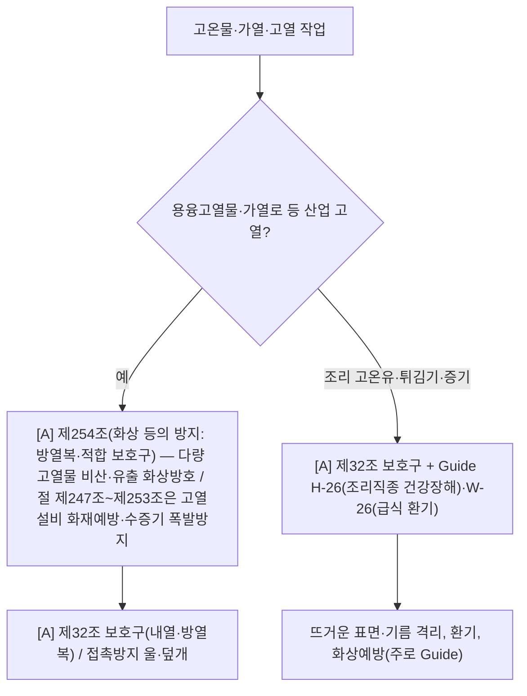

# 고온·화상 감독관 판단기준

> 재해형태 `BURN`/`TEMP_EXTREME_CONTACT`. 제조(용융고열물·가열로) + 음식점(튀김기·고온유·증기). 제조는 조문, 조리는 Guide 중심. `[A]`가시(일부 Guide 의존).

- **산업 고열**(용융금속·가열로·고열물): `[A]` **제254조(화상 등의 방지)** — 다량 고열물 비산·유출 화상방지 + 방열복·보호구 착용 의무 + 보호구 제32조. (같은 절 제247조~제253조은 고열설비 화재예방·수증기 폭발방지 성격)
- **조리 고온**(튀김기·증기·뜨거운 기름): 산안규칙 직접 조문 **얇음** → `[A]`제32조 보호구 + **Guide H-26(조리직종 건강장해)·W-26(단체급식 환기)**. (정직: 조리 화상의 정답 조문 빈약 — Guide 중심.)
- 조리 중 화재 동반 → H08-화재폭발파열 연계.

## 실무 문구
- 가열로·용융금속 접촉위험 → `[A]`제254조(화상방지) + 보호구 제32조.
- 튀김기·고온유 화상위험 → `[A]`제32조 + Guide H-26.

## expert 규칙
- intent BURN/TEMP 또는 단서(가열로·용융·튀김기·증기·고온표면) → 산업이면 제254조(화상방지)+제32조; 조리면 제32조+Guide H-26/W-26.
- ※ 용융고열물 절=제247조~제254조 확정(소스 대조). 화상 1차 조문=제254조, 제247조~제253조=고열설비 화재예방·수증기 폭발방지.
