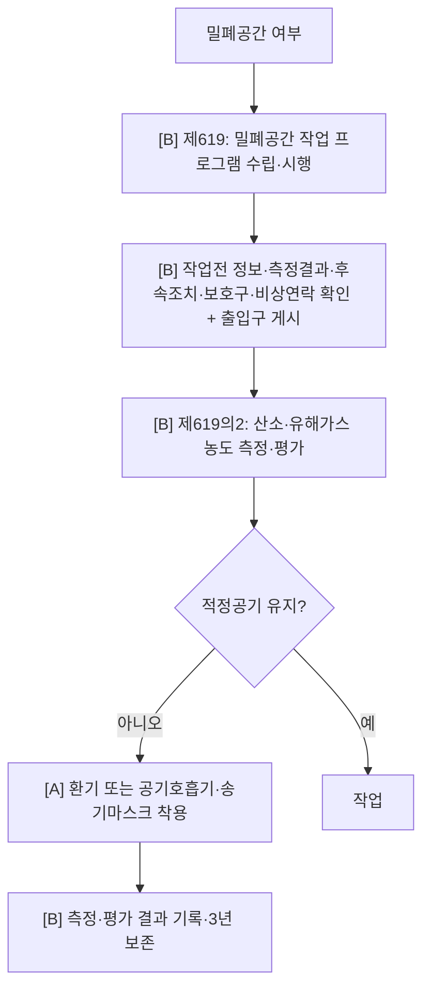

# 밀폐공간·질식 감독관 판단기준

> 재해유형 `CONFINED_SPACE_ASPHYXIA`. 프로그램 → 작업전 확인 → 산소·유해가스 측정 → 환기/호흡보호구 → 감시·구조 → 기록. 대부분 `[B]` 절차/측정이라 Track A 가시 한정적.

- **제619 [B]** 프로그램·작업전확인·게시(절차) · **제619의2 [B→일부A]** 측정·평가(절차)이나 **환기설비·송기마스크 착용은 가시 `[A]`**.

## 실무 문구
밀폐공간 작업 전 산소·유해가스 측정·적정공기 확인 미흡 → 프로그램 `[B]`제619 · 측정·환기·호흡보호구·기록 `[B/A]`제619의2.

## expert 규칙
- intent ASPHYXIATION/CONFINED 또는 단서(맨홀·탱크·정화조·송기마스크·환기덕트) → 제619·619의2. 대부분 [B] 자문, 환기·호흡구 착용 가시분만 [A].
