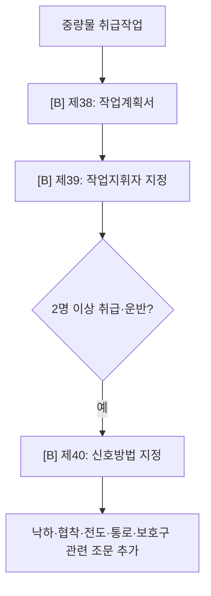

# 중량물·인력운반 감독관 판단기준

> 작업 `HEAVY_OBJECT`. 작업계획서 → 작업지휘자 → 신호 → 낙하·협착·요통 위험 방지. 절차 중심이라 Track A 가시 한정.

- **제38조·제39조·제40조 [B]** 계획·지휘·신호(절차) · 동반 위험은 낙하(제14조)·통로(제22조)·보호구(제32조).
- **근골격계부담작업 [B]** 반복·중량·부적절 자세 → 보건기준 제656조~제662조(유해요인조사·개선·예방관리프로그램) · 인력 들어올리기 제663조~제666조(중량 제한·휴식·작업자세) · 중량물 취급 제385조·제386조.

## 실무 문구
중량물 취급 안전조치 미흡 → 계획 `[B]`제38 · 지휘 `[B]`제39 · 신호 `[B]`제40 · 낙하·협착 동반시 해당 조문.

## expert 규칙
- intent HEAVY_OBJECT/단서(중량물·인양·2인운반) → 제38·39·40(주로 [B] 자문). 가시 위험(낙하 제14·보호구 제32)만 [A] 채점.
