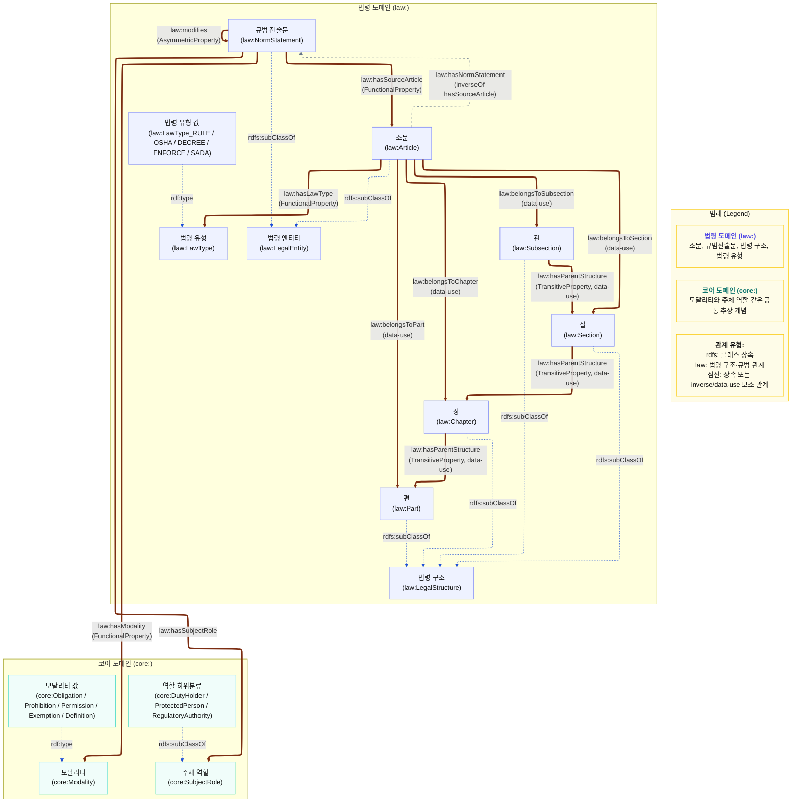

# 법령 레이어 상세도

법령 레이어는 조문 자체와 조문에서 추출한 규범 문장을 분리한다.

문서 기준일: 2026-05-05



## 핵심 TTL 예시

```ttl
law:RULE_제100조 a law:Article ;
    core:title "띠톱기계의 덮개 등"^^xsd:string ;
    law:articleCode "제100조"^^xsd:string ;
    law:hasLawType law:LawType_RULE .

law:NS-RULE100-0 a law:NormStatement ;
    core:identifier "NS-RULE100-0"^^xsd:string ;
    core:text "사업주는 ... 덮개 또는 울 등을 설치하여야 한다."^^xsd:string ;
    law:hasSourceArticle law:RULE_제100조 ;
    law:hasModality core:Obligation ;
    law:hasSubjectRole core:Employer ;
    law:hasAction "덮개 또는 울 등을 설치하여야 한다"^^xsd:string ;
    law:hasObject "띠톱기계 위험 톱날 부위 방호설비"^^xsd:string .
```

## Triple식 해석

- `law:RULE_제100조`는 / `law:hasLawType` 관계로 / `law:LawType_RULE`을 가진다.
- `law:NS-RULE100-0`은 / `law:hasSourceArticle` 관계로 / `law:RULE_제100조`를 가진다.
- `law:NS-RULE100-0`은 / `law:hasModality` 관계로 / `core:Obligation`을 가진다.
- `law:NS-RULE100-0`은 / `law:hasSubjectRole` 관계로 / `core:Employer`를 가진다.

## 실제 OWL 기준 주의점

- `law:Article`과 `law:NormStatement`는 `law:LegalEntity`의 하위 클래스다.
- `law:Part`, `law:Chapter`, `law:Section`, `law:Subsection`은 `law:LegalStructure`의 하위 클래스다.
- `law:hasLawType`, `law:hasSourceArticle`, `law:hasModality`는 `owl:FunctionalProperty`다. 즉 한 조문 또는 한 규범진술문에 대해 값이 하나로 제한되는 설계다.
- `law:hasNormStatement`는 `domain/range`가 직접 선언되어 있지 않고, `law:hasSourceArticle`의 `owl:inverseOf`로 정의되어 있다. 따라서 `Article -> hasNormStatement -> NormStatement`는 명시 데이터라기보다 역관계로 읽는 것이 정확하다.
- `law:belongsToPart`, `law:belongsToChapter`, `law:belongsToSection`, `law:belongsToSubsection`은 현재 OWL 스키마에 `domain/range`가 직접 선언되어 있지 않다. 다만 인스턴스 데이터에서는 `Article -> LegalStructure` 사용 패턴으로 쓰인다.
- `law:hasParentStructure`도 `domain/range`가 직접 선언되어 있지 않지만, `owl:TransitiveProperty`이며 인스턴스 데이터에서는 `Subsection -> Section -> Chapter -> Part` 방향으로 사용한다.
- `law:modifies`는 `NormStatement -> NormStatement`의 비대칭 관계(`owl:AsymmetricProperty`)다. 역관계인 `law:modifiedBy`도 OWL에 정의되어 있지만, 이 상세도에서는 핵심 방향인 `modifies`만 표시했다.
- `pen:PenaltyRule`도 실제 OWL에서는 `law:LegalEntity`의 하위 클래스지만, 벌칙 레이어 상세도에서 따로 다루므로 이 법령 레이어 그림에서는 생략했다.

## 주요 데이터 속성

- `core:title`: 사람이 읽는 제목
- `core:text`: 원문 또는 추출 문장
- `core:identifier`: 내부 식별자
- `law:articleCode`: 제100조 같은 조문 번호
- `law:hasAction`: 규범 문장의 행위
- `law:hasObject`: 행위의 대상
- `law:conditionText`: 단서/예외 조건 원문
- `law:paragraphRef`: 본문, 제1항, 단서 같은 위치 정보
