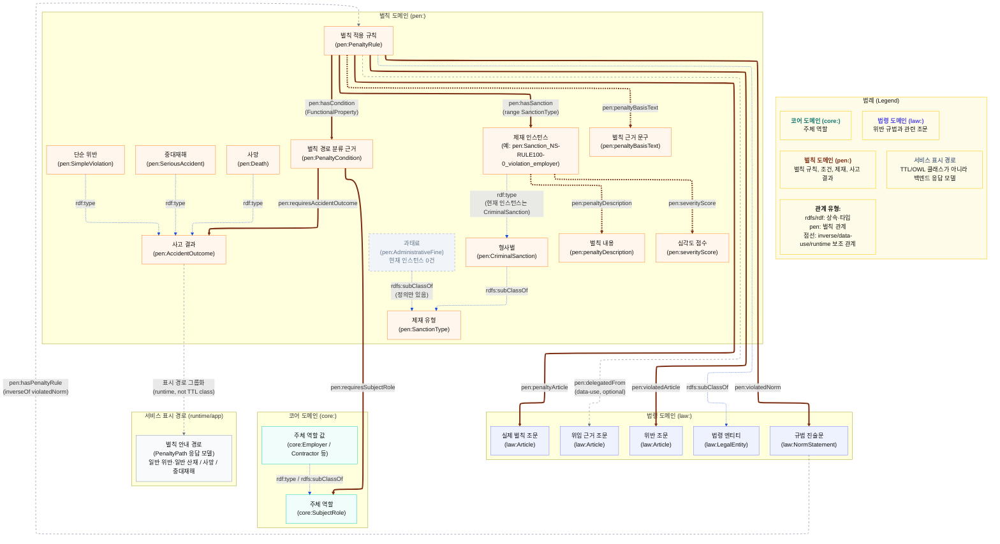

# 벌칙 레이어 상세도

벌칙 레이어는 “무슨 규범을 위반했는가”, “그 위반이 어떤 조문에서 왔는가”, “실제 벌칙 조문은 무엇인가”, “사업주 화면에서 어떤 벌칙 안내 경로로 보여줄 것인가”를 `PenaltyRule` 중심으로 묶는다.

문서 기준일: 2026-05-05

이번 구조에서 `PenaltyRoute`는 제거했고, `pen:penaltyForArticle`도 제거했다. 위반 조문은 `pen:violatedArticle`, 실제 벌칙 조문은 `pen:penaltyArticle`로 분리한다.



## 핵심 TTL 예시

```ttl
pen:PenaltyRule_NS-RULE100-0_violation_employer a pen:PenaltyRule ;
    pen:violatedNorm law:NS-RULE100-0 ;
    pen:violatedArticle law:RULE_제100조 ;
    pen:delegatedFrom law:OSHA_제38조 ;
    pen:penaltyArticle law:OSHA_제168조 ;
    pen:penaltyBasisText "산업안전보건법 제168조 제1호 (제38조 경유)"^^xsd:string ;
    pen:hasCondition pen:Condition_NS-RULE100-0_violation_employer ;
    pen:hasSanction pen:Sanction_NS-RULE100-0_violation_employer .

pen:Condition_NS-RULE100-0_violation_employer a pen:PenaltyCondition ;
    pen:requiresSubjectRole core:Employer ;
    pen:requiresAccidentOutcome pen:SimpleViolation .

pen:Sanction_NS-RULE100-0_violation_employer a pen:CriminalSanction ;
    pen:penaltyDescription "5년 이하의 징역 또는 5천만원 이하의 벌금"^^xsd:string ;
    pen:severityScore 5 .
```

## Triple식 해석

- `PenaltyRule_NS-RULE100-0_violation_employer`는 / `violatedNorm` 관계로 / `NS-RULE100-0`을 가진다.
- `PenaltyRule_NS-RULE100-0_violation_employer`는 / `violatedArticle` 관계로 / `RULE_제100조`를 가진다.
- `PenaltyRule_NS-RULE100-0_violation_employer`는 / `delegatedFrom` 관계로 / `OSHA_제38조`를 가진다.
- `PenaltyRule_NS-RULE100-0_violation_employer`는 / `penaltyArticle` 관계로 / `OSHA_제168조`를 가진다.
- `PenaltyRule_NS-RULE100-0_violation_employer`는 / `hasCondition` 관계로 / `Condition_NS-RULE100-0_violation_employer`를 가진다.
- `Condition_NS-RULE100-0_violation_employer`는 / `requiresSubjectRole` 관계로 / `Employer`를 가진다.
- `Condition_NS-RULE100-0_violation_employer`는 / `requiresAccidentOutcome` 관계로 / `SimpleViolation`을 가진다.
- `PenaltyRule_NS-RULE100-0_violation_employer`는 / `hasSanction` 관계로 / `Sanction_NS-RULE100-0_violation_employer`를 가진다.
- `Sanction_NS-RULE100-0_violation_employer`는 / `penaltyDescription` 관계로 / `"5년 이하의 징역 또는 5천만원 이하의 벌금"`을 가진다.
- `Sanction_NS-RULE100-0_violation_employer`는 / `severityScore` 관계로 / `5`를 가진다.

## 표시 기준

`PenaltyRule`이 여러 개 연결되어 있을 때 기본 사업주 화면에서는 하나의 벌칙만 확정 선택하지 않는다. 사진만으로 사업주/수급인 여부, 사망 발생, 중대재해 요건 충족 여부를 확정할 수 없기 때문이다.

예를 들어 `NS-RULE100-0`에는 다음 네 가지 후보가 있다.

- `violation_employer`: 주체가 사업주이고 단순 위반인 경우
- `violation_contractor`: 주체가 수급인이고 단순 위반인 경우
- `death`: 사망 사고가 발생한 경우
- `seriousAccident`: 중대재해처벌법상 중대재해 조건이 문제되는 경우

사진 업로드 서비스에서는 이를 다음 3개 경로로 묶어 보여준다.

```text
SimpleViolation → 일반 위반 또는 일반 산재 발생 시
Death → 사망 발생 시
SeriousAccident → 중대재해 요건 충족 시
```

`requiresSubjectRole`은 기본 화면에서 사업주/수급인을 확정하는 기준으로 쓰지 않고, 상세 근거에서만 유지한다.

## 실제 OWL 기준 주의점

- `pen:PenaltyRule`은 `law:LegalEntity`의 하위 클래스다.
- `pen:hasPenaltyRule`은 `law:NormStatement -> pen:PenaltyRule` 관계이고, `pen:violatedNorm`의 `owl:inverseOf`로 정의되어 있다.
- `pen:violatedNorm`, `pen:violatedArticle`, `pen:penaltyArticle`, `pen:hasCondition`, `pen:hasSanction`은 모두 `pen:PenaltyRule`을 주어로 갖는 핵심 관계다.
- `pen:hasCondition`은 `owl:FunctionalProperty`다. 즉 하나의 `PenaltyRule`은 하나의 `PenaltyCondition`을 갖는 설계다.
- `pen:delegatedFrom`은 현재 OWL 스키마에 `domain/range`가 직접 선언되어 있지 않지만, 인스턴스 데이터에서는 `PenaltyRule -> Article` 방향으로 사용된다. 중대재해처벌법 경로처럼 위임 조문이 없는 경우도 있어 선택적 관계다.
- `pen:hasSanction`의 range는 `pen:SanctionType`이다. 실제 인스턴스 데이터에서는 `pen:Sanction_*` 개체가 `pen:CriminalSanction` 타입으로 생성되어 있고, `CriminalSanction`은 `SanctionType`의 하위 클래스다.
- `pen:AdministrativeFine` 클래스는 정의되어 있지만, 현재 인스턴스 데이터 기준으로는 과태료 인스턴스가 없다.
- `pen:AccidentOutcome`은 `owl:oneOf`로 `SimpleViolation`, `Death`, `SeriousAccident` 세 값만 갖는 열거형 클래스다.
- `PenaltyPath`는 현재 TTL/OWL에 정의된 클래스가 아니라 백엔드 응답 모델이다. 따라서 Mermaid에서는 서비스 표시 경로로만 점선 표시했다.

## SeverityLevel 제거

`pen:SeverityLevel`과 `pen:hasSeverityLevel`은 제거했다. 심각도는 제재 인스턴스의 `pen:severityScore`를 직접 사용한다.

즉 구조는 다음처럼 단순화된다.

```text
PenaltyRule -> hasSanction -> SanctionInstance -> severityScore
```
