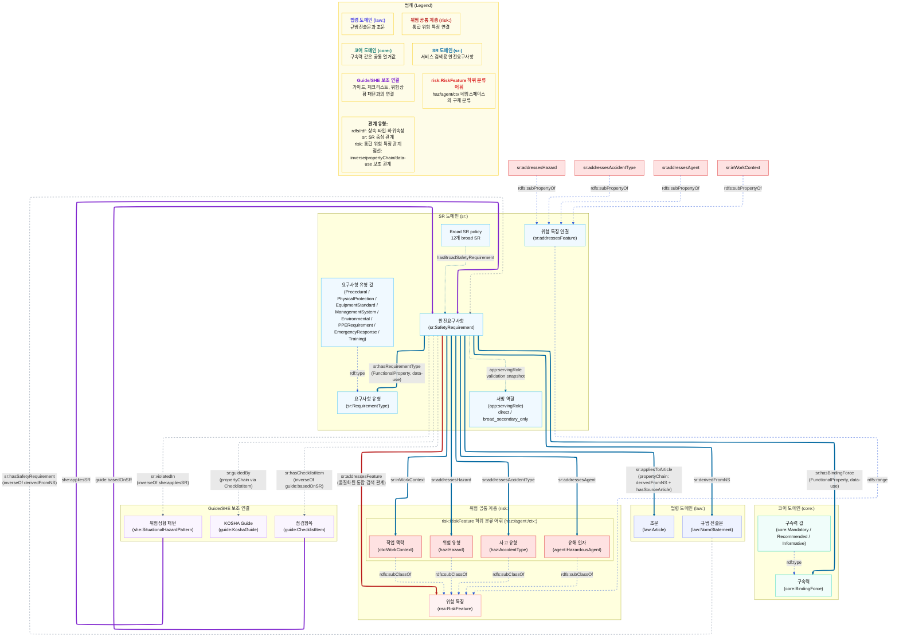

# 안전요구사항 레이어 상세도

안전요구사항 레이어는 법령의 규범진술문을 서비스가 검색하기 쉬운 요구사항 단위로 정리한다. 사진 관찰 결과는 법령 원문 전체와 직접 비교하기보다, 먼저 `SafetyRequirement`를 통해 관련 위험 특징과 법령 근거 후보를 좁힌다.

문서 기준일: 2026-05-15

최신 구조에서는 `sr:addressesFeature`를 통합 위험 특징 연결로 둔다. `sr:addressesHazard`, `sr:addressesAccidentType`, `sr:addressesAgent`, `sr:inWorkContext`는 구체 검색을 위한 하위 관계이고, 인스턴스 데이터에는 구체 관계와 `sr:addressesFeature`를 함께 물질화한다.

`haz:`, `agent:`, `ctx:`는 별도 독립 레이어가 아니라 `risk:RiskFeature` 아래의 하위 분류 어휘다. 즉 `risk:`가 위험 지식의 공통 추상 계층이고, `haz/agent/ctx`는 그 아래에서 사고유형, 유해인자, 작업맥락을 구체화하는 네임스페이스다.

`ci_candidate_promotion_v1` 기준 OHS 서빙에서는 SR을 `direct SR`과 `broad secondary SR`로 구분한다. broad SR은 검색 확장과 보조 점수에는 사용할 수 있지만, 단독으로 top Guide/CI나 법적 확정 근거를 만들 수 없다.



## 핵심 TTL 예시

```ttl
sr:SR-CHEMICAL-002 a sr:SafetyRequirement ;
    core:identifier "SR-CHEMICAL-002"^^xsd:string ;
    core:title "유해물질 발산원 밀폐설비 또는 국소배기장치 설치"^^xsd:string ;
    sr:derivedFromNS law:NS-RULE422-0 ;
    sr:appliesToArticle law:RULE_제422조 ;
    sr:hasBindingForce core:Mandatory ;
    sr:hasRequirementType sr:PhysicalProtection ;
    sr:addressesHazard haz:CHEMICAL_EXPOSURE ;
    sr:addressesAgent agent:Chemical ;
    sr:addressesFeature haz:CHEMICAL_EXPOSURE,
        agent:Chemical .

guide:CI-A1-014 a guide:ChecklistItem ;
    core:identifier "CI-A1-014"^^xsd:string ;
    core:text "모든 산 회화작업은 흄후드에서 이루어져야 한다."^^xsd:string ;
    guide:basedOnSR sr:SR-CHEMICAL-002 ;
    sr:hasBindingForce core:Mandatory ;
    sr:hasRequirementType sr:Environmental .
```

## Triple식 해석

- `sr:SR-CHEMICAL-002`는 / `sr:derivedFromNS` 관계로 / `law:NS-RULE422-0`을 가진다.
- `sr:SR-CHEMICAL-002`는 / `sr:appliesToArticle` 관계로 / `law:RULE_제422조`를 가진다.
- `sr:SR-CHEMICAL-002`는 / `sr:hasBindingForce` 관계로 / `core:Mandatory`를 가진다.
- `sr:SR-CHEMICAL-002`는 / `sr:hasRequirementType` 관계로 / `sr:PhysicalProtection`을 가진다.
- `sr:SR-CHEMICAL-002`는 / `sr:addressesHazard` 관계로 / `haz:CHEMICAL_EXPOSURE`를 가진다.
- `sr:SR-CHEMICAL-002`는 / `sr:addressesAgent` 관계로 / `agent:Chemical`을 가진다.
- `sr:SR-CHEMICAL-002`는 / `sr:addressesFeature` 관계로 / `haz:CHEMICAL_EXPOSURE`, `agent:Chemical`을 가진다.
- `guide:CI-A1-014`는 / `guide:basedOnSR` 관계로 / `sr:SR-CHEMICAL-002`를 가진다.

## 실제 OWL 기준 주의점

- `sr:SafetyRequirement` 인스턴스는 현재 626개다.
- `sr:derivedFromNS`는 `domain sr:SafetyRequirement`, `range law:NormStatement`가 직접 선언되어 있다. `FunctionalProperty`는 아니므로 하나의 SR이 여러 규범진술문에서 유래할 수 있다.
- `sr:appliesToArticle`은 `domain sr:SafetyRequirement`, `range law:Article`이 직접 선언되어 있고, `(sr:derivedFromNS law:hasSourceArticle)`의 `owl:propertyChainAxiom`도 가진다. 즉 SR이 출처 NS를 알면 조문까지 이어질 수 있도록 만든 관계다.
- `sr:addressesFeature`는 `domain sr:SafetyRequirement`, `range risk:RiskFeature`를 가진 통합 검색 관계다.
- `sr:addressesHazard`, `sr:addressesAccidentType`, `sr:addressesAgent`, `sr:inWorkContext`는 각각 `sr:addressesFeature`의 하위 속성이다.
- 실시간 서비스는 reasoner에 의존하지 않도록 구체 관계와 `sr:addressesFeature`를 함께 저장한다. 예를 들어 `sr:addressesAgent agent:Chemical`이 있으면 `sr:addressesFeature agent:Chemical`도 명시 트리플로 둔다.
- `sr:hasRequirementType`, `sr:hasBindingForce`는 `owl:FunctionalProperty`지만 현재 OWL에는 `domain/range`가 직접 선언되어 있지 않다. 실제 데이터에서는 `SafetyRequirement`뿐 아니라 `ChecklistItem`에도 쓰이므로, domain을 SR로 고정하면 체크리스트까지 SR로 추론되는 문제가 생길 수 있다.
- `guide:basedOnSR`는 실제 데이터가 있는 직접 관계다. 반대로 `sr:hasChecklistItem`은 `guide:basedOnSR`의 inverse 관계로 정의되어 있으며, 현재 명시 트리플은 없다.
- `sr:guidedBy`는 `sr:hasChecklistItem -> guide:isChecklistItemOf`를 통해 가이드까지 이어지는 property chain 관계다. 현재 명시 트리플은 없고, 추론 또는 서비스 로직에서 활용할 수 있는 보조 관계로 보는 것이 맞다.
- `app:servingRole "broad_secondary_only"`는 core SR ontology의 법적 의미가 아니라 `serving-snapshot-ci_candidate_promotion_v1.ttl`의 검증용 정책 주석이다. 현재 broad SR은 12개이며, 단독 top Guide/CI 생성 금지 규칙은 `serving-validation-shapes.ttl`과 `validate_serving_snapshot.py`에서 검사한다.

## 사용 방식

사진에서 나온 관찰 특징은 직접 법령 전체와 비교하지 않고, 먼저 `she:SituationalHazardPattern`과 `SafetyRequirement` 후보를 찾는 검색 조건으로 쓴다. 예를 들어 기계, 절단 위험, 방호덮개 없음 같은 특징은 기계 관련 물리적 보호 요구사항 후보를 좁히는 데 사용한다.

`SafetyRequirement`는 이후 `NormStatement / Article`, `Guide / WorkProcess`, `PenaltyRule`을 연결하는 중심 브릿지다. 사진 단서가 곧바로 위반 확정이 되는 것이 아니라, SR을 거쳐 법령 근거와 개선 절차를 함께 확인한다.

서빙에서는 SHE에서 직접 도달한 SR과 broad SR 후보를 분리한다. broad SR은 “PPE 필요”, “화재·폭발 일반관리”, “전기 일반관리”처럼 넓은 요구사항이어서, Guide-specific usage profile, visual trigger, WorkProcess relevance 같은 구체 신호가 있을 때만 보조 점수로 반영한다.
