# KOSHA 가이드 레이어 상세도

가이드 레이어는 사업주에게 제시할 개선 절차를 구성하는 핵심 지식이다. 최신 구조에서는 `guide:KoshaGuide`와 `guide:WorkProcess`를 표준 개선 절차의 중심으로 두고, `guide:ChecklistItem`은 즉시 조치 후보이자 시각 단서/검색 색인/보조 근거로 사용한다.

문서 기준일: 2026-05-10

중요한 점은 `ChecklistItem` 하나가 곧 최종 조치 본체라는 뜻은 아니라는 것이다. 화면에서는 “즉시 조치”로 먼저 보여줄 수 있지만, KOSHA Guide 문서 전체와 그 안의 작업 절차가 사업주 안내의 본체이고, 체크리스트는 사진 속 단서와 `SR/Guide`를 이어주는 작은 근거 조각이다.

```mermaid
---
config:
  layout: elk
---
flowchart TB
    %% LEGEND
    subgraph Legend["범례 (Legend)"]
      direction TB
      GuideLegend["<b style='color:#7e22ce;'>가이드 도메인 (guide:)</b><br/>KOSHA Guide, 체크리스트, 작업절차, 용어, 장비, 문서"]
      SRLegend["<b style='color:#0369a1;'>SR 도메인 (sr:)</b><br/>가이드 지식이 연결되는 안전요구사항"]
      RiskLegend["<b style='color:#b91c1c;'>위험 특징 분류</b><br/>CI가 색인으로 보유하는 사고유형/유해인자/작업맥락"]
      SheLegend["<b style='color:#7e22ce;'>SHE 보조 연결</b><br/>위험상황 패턴에서 체크리스트 단서로 이어지는 연결"]
      AppLegend["<b style='color:#d97706;'>실행/응답 도메인 (app/runtime)</b><br/>사업주 화면의 조치 추천 구성"]
      StorageLegend["<b style='color:#64748b;'>서비스/물질화 함수와 저장소</b><br/>PostgreSQL 조회, Pipe-B import, OWL/TTL export"]
      RelationLegend["<b>관계 유형:</b><br/><span style='color:#1d4ed8;'>rdfs/rdf/owl:</span> 상속·타입·inverse·propertyChain<br/><span style='color:#7e22ce;'>guide:</span> 가이드 내부·SR 연결<br/><span style='color:#0369a1;'>sr:</span> SR에서 가이드로 가는 추론/보조 관계<br/><span style='color:#b91c1c;'>risk feature:</span> CI 검색 색인<br/><span style='color:#d97706;'>app:</span> 실행 결과 관계<br/><span style='color:#64748b;'>점선:</span> runtime/schema-only/data-use/현재 data 0"]
    end

    %% GUIDE MODEL
    subgraph GuideDomain["가이드 도메인 (guide:)"]
      direction TB
      KoshaGuide["KOSHA Guide<br/>(guide:KoshaGuide)<br/>1,038개"]
      ChecklistItem["점검항목<br/>(guide:ChecklistItem)<br/>54,571개<br/>즉시 조치/보조 단서/검색 색인"]
      WorkProcess["작업 프로세스<br/>(guide:WorkProcess)<br/>9,320개<br/>표준 절차/흐름"]
      DomainTerm["도메인 용어<br/>(guide:DomainTerm)<br/>7,728개"]
      EquipmentSpec["장비 규격<br/>(guide:EquipmentSpec)<br/>8,103개"]
      DocumentRequirement["문서 요구사항<br/>(guide:DocumentRequirement)<br/>3,441개"]
      GuideInterLink["가이드 참조 링크<br/>(guide:GuideInterLink)<br/>89개<br/>data-use, schema 누락"]
      ReferenceMeta["참조 유형/문구<br/>(referenceType / referenceText)<br/>data-use, schema 누락"]
    end

    %% SR MODEL
    subgraph SRDomain["SR 도메인 (sr:)"]
      direction TB
      SafetyRequirement["안전요구사항<br/>(sr:SafetyRequirement)"]
    end

    %% RISK FEATURE MODEL
    subgraph RiskFeatureDomain["CI 검색용 위험 특징 분류"]
      direction TB
      AccidentType["사고 유형<br/>(haz:AccidentType)"]
      HazardousAgent["유해 인자<br/>(agent:HazardousAgent)"]
      WorkContext["작업 맥락<br/>(ctx:WorkContext)"]
    end

    %% SHE MODEL
    subgraph SheDomain["SHE 보조 연결"]
      direction TB
      SHEPattern["위험상황 패턴<br/>(she:SituationalHazardPattern)"]
    end

    %% APP / RUNTIME RESPONSE MODEL
    subgraph AppDomain["실행/응답 도메인 (app/runtime)"]
      direction TB
      CorrectiveAction["개선 조치<br/>(app:CorrectiveAction)"]
      ActionRecommendation["조치 추천 항목<br/>(app:ActionRecommendation)<br/>API 응답 모델"]
      DisplayGroup["표시 그룹<br/>immediate_action / standard_procedure / legal_basis"]
      Urgency["긴급도<br/>immediate / planned / reference"]
    end

    %% SERVICE / MATERIALIZATION FUNCTIONS
    subgraph RuntimeDomain["서비스/물질화 함수와 저장소"]
      direction LR

      subgraph RuntimeService["실시간 서비스 함수"]
        direction TB
        GetChecklist["hazard_rule_engine.get_checklist_from_srs()<br/>SR → CI 조회"]
        GetGuides["hazard_rule_engine.get_guides_from_srs()<br/>SR → CI → Guide 역추적"]
        BuildActions["analysis_service._build_action_recommendations()<br/>즉시조치/표준절차/근거 그룹화"]
      end

      subgraph RuntimeStorage["서빙용 PostgreSQL 저장소"]
        direction TB
        KoshaGuidesTable["kosha_guides"]
        ChecklistTable["checklist_items"]
        CiSrTable["ci_sr_mapping"]
        WorkProcessTable["work_processes / wp_sr_mapping"]
        DomainTermTable["domain_terms / dt_sr_mapping"]
        EquipmentTable["equipment_specs / es_sr_mapping"]
        DocumentTable["document_requirements / dr_sr_mapping"]
        GuideLinkTable["guide_inter_links"]
      end

      subgraph RuntimeBatch["Pipe-B/TTL 물질화"]
        direction TB
        ImportPipeB["pipe-B/db/import_pipeb.py<br/>가이드 JSON → PG"]
        ImportPipeC["pipe-C/db/import_pipec.py<br/>guide_inter_links 적재"]
        ExportOWL["ontology/scripts/export_owl.py<br/>PG → guide:* TTL/OWL"]
      end
    end

    %% guide internal relationships
    KoshaGuide G01@==>|"guide:hasChecklistItem<br/>54,571건"| ChecklistItem
    ChecklistItem G02@-.->|"guide:isChecklistItemOf<br/>(inverse, 명시 data 0)"| KoshaGuide
    KoshaGuide G03@==>|"guide:hasWorkProcess<br/>9,320건"| WorkProcess
    KoshaGuide G04@==>|"guide:hasDomainTerm<br/>7,728건"| DomainTerm
    KoshaGuide G05@==>|"guide:hasEquipmentSpec<br/>8,103건"| EquipmentSpec
    KoshaGuide G06@==>|"guide:hasDocumentRequirement<br/>3,441건"| DocumentRequirement
    KoshaGuide G07@==>|"guide:referencesGuide<br/>89건"| KoshaGuide

    %% guide -> SR relationships
    ChecklistItem S01@==>|"guide:basedOnSR<br/>10,682건"| SafetyRequirement
    WorkProcess S02@==>|"guide:relatedSR<br/>3,599건"| SafetyRequirement
    EquipmentSpec S03@==>|"guide:specForSR<br/>1,342건"| SafetyRequirement
    DocumentRequirement S04@==>|"guide:docForSR<br/>389건"| SafetyRequirement
    DomainTerm S05@-.->|"guide:termForSR<br/>schema-only/data 0"| SafetyRequirement
    DomainTerm S06@-.->|"guide:termNameForSR<br/>data-use/schema 누락, 367건"| SafetyRequirement

    %% inverse / property chain relationships
    SafetyRequirement R01@-.->|"sr:hasChecklistItem<br/>(inverseOf basedOnSR)"| ChecklistItem
    SafetyRequirement R02@-.->|"sr:guidedBy<br/>(hasChecklistItem → isChecklistItemOf)"| KoshaGuide

    %% CI feature index relationships
    ChecklistItem F01@==>|"guide:ciAddressesAccidentType<br/>13,104건"| AccidentType
    ChecklistItem F02@==>|"guide:ciAddressesAgent<br/>27,628건"| HazardousAgent
    ChecklistItem F03@==>|"guide:ciInWorkContext<br/>11,029건"| WorkContext

    %% SHE helper relationships
    SHEPattern H01@==>|"she:relatedChecklistCue<br/>28,504건"| ChecklistItem
    SHEPattern H02@-.->|"she:relatedGuide<br/>schema/data 0"| KoshaGuide
    SHEPattern H03@-.->|"she:appliesCI<br/>schema/data 0"| ChecklistItem
    ChecklistItem H04@-.->|"guide:realizesSHE<br/>(inverseOf she:appliesCI, data 0)"| SHEPattern

    %% GuideInterLink reification / data-use
    GuideInterLink I01@-.->|"guide:linkSource<br/>data-use"| KoshaGuide
    GuideInterLink I02@-.->|"guide:linkTarget<br/>data-use"| KoshaGuide
    GuideInterLink I03@-.->|"guide:referenceType / referenceText<br/>data-use"| ReferenceMeta

    %% app/action relationships
    CorrectiveAction A01@-.->|"app:guidedBy<br/>schema, 현재 RDF data 0"| KoshaGuide
    CorrectiveAction A02@-.->|"app:usesChecklistCue<br/>schema, 현재 RDF data 0"| ChecklistItem
    CorrectiveAction A03@-.->|"app:citesRequirement<br/>schema, 현재 RDF data 0"| SafetyRequirement
    CorrectiveAction A04@-.->|"app:hasActionRecommendation<br/>schema, 현재 RDF data 0"| ActionRecommendation
    ActionRecommendation A05@-.->|"app:recommendedRequirement<br/>schema, 현재 RDF data 0"| SafetyRequirement
    ActionRecommendation A06@-.->|"display_group<br/>(runtime field)"| DisplayGroup
    ActionRecommendation A07@-.->|"urgency<br/>(runtime field)"| Urgency

    %% runtime / materialization flow
    ImportPipeB T01@-.->|"적재"| KoshaGuidesTable
    ImportPipeB T02@-.->|"적재"| ChecklistTable
    ImportPipeB T03@-.->|"적재"| WorkProcessTable
    ImportPipeB T04@-.->|"적재"| DomainTermTable
    ImportPipeB T05@-.->|"적재"| EquipmentTable
    ImportPipeB T06@-.->|"적재"| DocumentTable
    ImportPipeC T07@-.->|"적재"| GuideLinkTable
    ExportOWL T08@-.->|"PG → TTL"| KoshaGuide
    ExportOWL T09@-.->|"PG → TTL"| ChecklistItem
    ExportOWL T10@-.->|"PG → TTL"| WorkProcess
    ExportOWL T11@-.->|"PG → TTL"| DomainTerm
    ExportOWL T12@-.->|"PG → TTL"| EquipmentSpec
    ExportOWL T13@-.->|"PG → TTL"| DocumentRequirement
    GetChecklist T14@-.->|"ci_sr_mapping"| CiSrTable
    GetChecklist T15@-.->|"CI 조회"| ChecklistTable
    GetGuides T16@-.->|"CI source_guide 집계"| ChecklistTable
    GetGuides T17@-.->|"Guide 조회"| KoshaGuidesTable
    GetChecklist T18@-.->|"즉시 조치 후보"| BuildActions
    GetGuides T19@-.->|"표준 개선 절차 후보"| BuildActions
    BuildActions T20@-.->|"ActionRecommendation 생성"| ActionRecommendation

    %% STYLING
    classDef guide fill:#faf5ff,stroke:#c084fc,color:#111;
    classDef sr fill:#f0f9ff,stroke:#38bdf8,color:#111;
    classDef feature fill:#fee2e2,stroke:#dc2626,color:#111;
    classDef she fill:#faf5ff,stroke:#a855f7,color:#111;
    classDef app fill:#fff7ed,stroke:#f59e0b,color:#111;
    classDef runtime fill:#f1f5f9,stroke:#64748b,color:#111;
    classDef storage fill:#f8fafc,stroke:#94a3b8,color:#111;
    classDef schemaOnly fill:#f3f4f6,stroke:#9ca3af,color:#6b7280,stroke-dasharray: 5 5;
    classDef legend fill:#fefce8,stroke:#facc15,color:#111;
    classDef guideedge stroke:#7e22ce,color:#7e22ce;
    classDef sredge stroke:#0369a1,color:#0369a1,stroke-dasharray: 5 5;
    classDef featureedge stroke:#b91c1c,color:#b91c1c;
    classDef sheedge stroke:#7e22ce,color:#7e22ce;
    classDef appedge stroke:#d97706,color:#d97706,stroke-dasharray: 5 5;
    classDef runtimeedge stroke:#64748b,color:#64748b,stroke-dasharray: 5 5;
    classDef schemaedge stroke:#94a3b8,color:#64748b,stroke-dasharray: 3 3;

    class KoshaGuide,ChecklistItem,WorkProcess,DomainTerm,EquipmentSpec,DocumentRequirement guide;
    class GuideInterLink,ReferenceMeta schemaOnly;
    class SafetyRequirement sr;
    class AccidentType,HazardousAgent,WorkContext feature;
    class SHEPattern she;
    class CorrectiveAction,ActionRecommendation,DisplayGroup,Urgency app;
    class GetChecklist,GetGuides,BuildActions,ImportPipeB,ImportPipeC,ExportOWL runtime;
    class KoshaGuidesTable,ChecklistTable,CiSrTable,WorkProcessTable,DomainTermTable,EquipmentTable,DocumentTable,GuideLinkTable storage;
    class Legend,GuideLegend,SRLegend,RiskLegend,SheLegend,AppLegend,StorageLegend,RelationLegend legend;
    class G01,G03,G04,G05,G06,G07,S01,S02,S03,S04,F01,F02,F03,H01 guideedge;
    class R01,R02,S05,S06,G02,H02,H03,H04,I01,I02,I03 schemaedge;
    class A01,A02,A03,A04,A05,A06,A07 appedge;
    class T01,T02,T03,T04,T05,T06,T07,T08,T09,T10,T11,T12,T13,T14,T15,T16,T17,T18,T19,T20 runtimeedge;
```



## 핵심 TTL 예시

아래 예시는 현재 `kosha-instances.ttl`에 있는 실제 데이터 형태를 기준으로 줄인 것이다.

```ttl
guide:A-121-2018 a guide:KoshaGuide ;
    core:title "에틸아크릴레이트에 대한 작업환경측정·분석 기술지침"^^xsd:string ;
    guide:guideCode "A-121-2018"^^xsd:string ;
    guide:shortCode "A121"^^xsd:string ;
    guide:domain "E"^^xsd:string ;
    guide:hasChecklistItem guide:CI-A121-005 ;
    guide:hasWorkProcess guide:WP-A121-01 ;
    guide:hasDocumentRequirement guide:DR-A121-001 .

guide:CI-A121-005 a guide:ChecklistItem ;
    core:identifier "CI-A121-005"^^xsd:string ;
    core:text "시료의 시험, 바탕시험 및 표준액에 대한 일련의 동일시험을 행할 때 사용하는 시약 또는 시액은 동일 롯트(LOT)로 조제된 것을 사용한다."^^xsd:string ;
    guide:sourceGuide "A-121-2018"^^xsd:string ;
    guide:sourceSection "4"^^xsd:string ;
    guide:basedOnSR sr:SR-CONFINED-001 .

guide:WP-A121-01 a guide:WorkProcess ;
    core:identifier "WP-A121-01"^^xsd:string ;
    guide:processName "시료채취 펌프 보정 및 준비"^^xsd:string ;
    guide:safetyMeasures "시료채취 펌프를 시료채취 시와 동일한 연결 상태에서 보정한다..."^^xsd:string ;
    guide:relatedSR sr:SR-CONFINED-001 .

guide:CI-AG1-028 a guide:ChecklistItem ;
    core:text "추락방호망의 설치 및 해체작업에 투입되는 근로자는 안전대의 착용은 물론 비계를 조립하는 등의 방법으로 작업발판을 설치하는 등의 안전조치를 선행한 다음 작업한다."^^xsd:string ;
    guide:basedOnSR sr:SR-FALL-003 ;
    guide:ciAddressesAccidentType haz:Fall,
        haz:Collapse ;
    guide:ciAddressesAgent agent:Chemical ;
    guide:ciInWorkContext ctx:Scaffold .
```

## Triple식 해석

- `guide:A-121-2018`은 / `guide:hasChecklistItem` 관계로 / `guide:CI-A121-005`를 가진다.
- `guide:A-121-2018`은 / `guide:hasWorkProcess` 관계로 / `guide:WP-A121-01`을 가진다.
- `guide:CI-A121-005`는 / `guide:basedOnSR` 관계로 / `sr:SR-CONFINED-001`을 가진다.
- `guide:WP-A121-01`은 / `guide:relatedSR` 관계로 / `sr:SR-CONFINED-001`을 가진다.
- `guide:CI-AG1-028`은 / `guide:ciInWorkContext` 관계로 / `ctx:Scaffold`를 가진다.
- `guide:CI-AG1-028`은 / `guide:ciAddressesAccidentType` 관계로 / `haz:Fall`, `haz:Collapse`를 가진다.

## 실제 OWL/TTL 기준 주의점

- 현재 materialized DB/ontology audit 기준 개수는 `KoshaGuide 1,038`, `ChecklistItem 54,571`, `WorkProcess 9,320`, `DomainTerm 7,728`, `EquipmentSpec 8,103`, `DocumentRequirement 3,441`이다.
- `C-73` 재생성 이후 최신 `ci-output` 엔티티 검증값은 `ChecklistItem 54,631`, `WorkProcess 9,316`, `DomainTerm 7,726`, `EquipmentSpec 8,103`, `DocumentRequirement 3,435`이다. 아직 Pipe-C audit/DB materialization을 다시 수행하지 않았으므로, 운영 기준 수치와 최신 추출 검증 수치를 섞어 asserted 근거처럼 쓰면 안 된다.
- `guide:hasChecklistItem`, `guide:hasWorkProcess`, `guide:hasDomainTerm`, `guide:hasEquipmentSpec`, `guide:hasDocumentRequirement`는 OWL에 ObjectProperty로 정의되어 있지만, 현재 스키마에는 `domain/range`가 직접 선언되어 있지 않다. 실제 데이터에서는 `KoshaGuide -> 각 구성요소` 방향으로 사용한다.
- `guide:isChecklistItemOf`는 `guide:hasChecklistItem`의 inverse 관계로 정의되어 있지만, 현재 명시 데이터는 0건이다.
- `guide:basedOnSR`은 `ChecklistItem -> SafetyRequirement` 직접 관계이고, 현재 materialized `ci_sr_mapping` 기준 10,682건이다.
- `guide:relatedSR`, `guide:specForSR`, `guide:docForSR`은 각각 `WorkProcess`, `EquipmentSpec`, `DocumentRequirement`가 SR과 연결되는 실제 데이터 관계다.
- `guide:termForSR`은 OWL 스키마에 정의되어 있지만 현재 데이터는 0건이다. 반대로 `guide:termNameForSR`은 인스턴스 데이터에 367건이 있지만 OWL 스키마 정의가 없다. 즉 용어-SR 연결은 명명 불일치가 있는 상태라 후속 정리가 필요하다.
- `guide:referencesGuide`는 `owl:SymmetricProperty`이고 현재 89건의 가이드 상호참조가 있다.
- `guide:GuideInterLink`, `guide:linkSource`, `guide:linkTarget`, `guide:referenceType`, `guide:referenceText`는 인스턴스 데이터에는 있지만 현재 OWL 스키마 정의가 빠져 있다. 그래서 Mermaid에서는 회색 `data-use/schema 누락`으로 표시했다.
- `guide:realizesSHE`는 `she:appliesCI`의 inverse 관계로 정의되어 있지만 현재 데이터는 0건이다. 실제 SHE 쪽에서는 `she:relatedChecklistCue`가 28,504건으로 활발히 쓰인다.
- `she:relatedGuide`는 OWL 스키마에 있지만 현재 데이터는 0건이다. 현재 서비스는 `SHE -> CI -> source_guide -> Guide` 또는 `SR -> CI -> source_guide -> Guide` 경로로 가이드를 찾는다.
- `app:followsProcess`는 현재 OWL 스키마에 없다. 따라서 “개선조치가 WorkProcess를 직접 따른다”는 관계는 문서에서 실제 관계로 그리지 않았다.

## 서비스에서의 역할

현재 서비스의 조치 추천 흐름은 다음과 같다.

```text
SHE 또는 SR 후보
→ get_checklist_from_srs()
→ ChecklistItem 즉시 조치 후보
→ get_guides_from_srs()
→ CI source_guide를 집계해 KOSHA Guide 후보 산출
→ _build_action_recommendations()
→ immediate_action / standard_procedure / legal_basis 그룹으로 응답
```

`ChecklistItem`은 사업주 화면에서 즉시 확인할 수 있는 조치 후보로 쓰인다. 하지만 표준 개선 절차를 구성할 때는 `KoshaGuide`와 `WorkProcess`가 더 큰 맥락을 제공한다. 현재 API 응답의 `ActionRecommendation`은 `display_group`과 `urgency` 필드로 즉시 조치와 표준 절차를 구분한다.

## 현재 데이터 기준 핵심 숫자

| 관계 | 현재 트리플 수 | 의미 |
|---|---:|---|
| `guide:hasChecklistItem` | 54,571 | Guide가 보유한 체크리스트 |
| `guide:hasWorkProcess` | 9,320 | Guide가 보유한 작업 절차 |
| `guide:hasDomainTerm` | 7,728 | Guide가 보유한 용어 |
| `guide:hasEquipmentSpec` | 8,103 | Guide가 보유한 장비 규격 |
| `guide:hasDocumentRequirement` | 3,441 | Guide가 보유한 문서 요구사항 |
| `guide:basedOnSR` | 10,682 | CI가 근거로 삼는 SR |
| `guide:relatedSR` | 3,599 | WorkProcess가 연결된 SR |
| `guide:specForSR` | 1,342 | 장비 규격이 연결된 SR |
| `guide:docForSR` | 389 | 문서 요구사항이 연결된 SR |
| `guide:ciAddressesAccidentType` | 13,104 | CI의 사고유형 색인 |
| `guide:ciAddressesAgent` | 27,628 | CI의 유해인자 색인 |
| `guide:ciInWorkContext` | 11,029 | CI의 작업맥락 색인 |
| `she:relatedChecklistCue` | 28,504 | SHE 패턴이 참조하는 체크리스트 단서 |

정리하면, 가이드 레이어는 “조치 본문”과 “검색 색인”이 같이 들어 있는 레이어다. `KoshaGuide/WorkProcess`는 사업주가 따라야 할 절차적 설명의 중심이고, `ChecklistItem`은 사진 관찰 단서와 SR/Guide를 빠르게 연결하는 실무적 색인이다.
