# 위험상황 레이어 상세도

위험상황 레이어는 사진별 사건 저장소가 아니라, 여러 사진에서 반복 재사용할 수 있는 위험상황 패턴 사전이다. 사진에서 나온 관찰 단서는 곧바로 법령 위반으로 확정되지 않고, 먼저 `risk:RiskFeature` 계열 특징과 `she:VisualTrigger`를 거쳐 `she:SituationalHazardPattern` 후보로 매칭된다.

문서 기준일: 2026-05-15

최신 구조에서는 `risk:`를 위험 지식의 공통 추상 계층으로 둔다. `haz:`, `agent:`, `ctx:`는 `risk:RiskFeature` 아래의 하위 분류 어휘이고, `she:`는 재사용 위험상황 패턴과 시각 트리거에 집중한다.

OHS 서빙에서는 Stage 2와 Stage 3 사이에 `SituationFrame`을 둔다. 이는 core ontology의 새 법적 판단 계층이 아니라, child context와 safe cue를 보존해 Guide/CI 추천을 보조하는 serving/evaluation 표현이다. child context는 의미 판단에 쓰고, parent context는 검색 확장에만 쓴다.

```text
risk:RiskFeature
 ├─ haz:Hazard
 ├─ haz:AccidentType
 ├─ agent:HazardousAgent
 └─ ctx:WorkContext / WorkActivity / PPEState / EnvironmentalFactor / AgentState / TemporalStage

risk:RiskPattern
 └─ she:SituationalHazardPattern
```



```mermaid
---
config:
  layout: elk
---
flowchart TB
    %% LEGEND
    subgraph Legend["범례 (Legend)"]
      direction TB
      AppLegend["<b style='color:#d97706;'>실행 도메인 (app:)</b><br/>사진 분석 결과와 매칭 결과 요약"]
      RiskLegend["<b style='color:#b91c1c;'>위험 공통 계층 (risk:)</b><br/>위험 특징과 위험 패턴의 추상 계층"]
      FeatureLegend["<b style='color:#dc2626;'>risk:RiskFeature 하위 분류 어휘</b><br/>haz/agent/ctx 네임스페이스의 구체 특징"]
      SheLegend["<b style='color:#7e22ce;'>risk 하위 위험상황 패턴 도메인 (she:)</b><br/>재사용 패턴, 시각 트리거, SR/Guide/CI 연결"]
      TargetLegend["<b style='color:#475569;'>연결 대상</b><br/>SR, Guide, Checklist, Penalty 후보"]
      RuntimeLegend["<b style='color:#64748b;'>서비스/물질화 함수</b><br/>TTL/OWL 클래스가 아니라 백엔드·배치 구현부"]
      RelationLegend["<b>관계 유형:</b><br/><span style='color:#1d4ed8;'>rdfs/rdf:</span> 상속·타입·하위속성<br/><span style='color:#b91c1c;'>risk:hasFeature</span> 모든 위험 특징을 묶는 추상/통합 관계<br/><span style='color:#7e22ce;'>she:has*</span> risk:hasFeature의 하위 구체 관계<br/><span style='color:#d97706;'>app:</span> 실행 결과 관계<br/><span style='color:#64748b;'>점선:</span> runtime/data-use/schema-only 보조 관계"]
    end

    %% APP / RUNTIME DATA MODEL
    subgraph AppDomain["실행 도메인 (app:)"]
      direction TB
      UploadedPhoto["업로드 사진<br/>(app:UploadedPhoto)"]
      Observation["관찰 사실<br/>(app:VisualObservation)"]
      VisualCue["시각 단서<br/>(app:VisualCue)"]
      SituationFrame["상황 프레임<br/>(app:SituationFrame)<br/>serving/evaluation"]
      ChildContext["세부 child context<br/>BAND_SAW / DRY_CLEANING_SOLVENT ..."]
      ParentContext["상위 parent context<br/>MACHINE / CHEMICAL_WORK ..."]
      MatchPolicy["매칭 정책<br/>status_safe / guide_support_only / confirmation_required"]
      SituationMatch["상황 매칭<br/>(app:SituationMatch)"]
      HazardFinding["위험 판단<br/>(app:HazardFinding)"]
      MatchConfidence["매칭 신뢰도<br/>(app:matchConfidence)"]
      ObservationConfidence["관찰 신뢰도 기록값<br/>(app:confidence)<br/>현재 판정 핵심 입력 아님"]
    end

    %% RISK MODEL
    subgraph RiskDomain["위험 공통 계층 (risk:)"]
      direction TB
      RiskFeature["위험 특징<br/>(risk:RiskFeature)"]
      RiskPattern["위험 패턴<br/>(risk:RiskPattern)"]
      HasFeature["위험 특징 보유<br/>(risk:hasFeature)"]

      subgraph FeatureDomain["risk:RiskFeature 하위 분류 어휘 (haz:/agent:/ctx:)"]
        direction TB
        Hazard["위험 유형<br/>(haz:Hazard)"]
        AccidentType["사고 유형<br/>(haz:AccidentType)"]
        HazardousAgent["유해 인자<br/>(agent:HazardousAgent)"]
        WorkContext["작업 맥락<br/>(ctx:WorkContext)"]
        WorkActivity["작업 활동<br/>(ctx:WorkActivity)"]
        PPEState["보호구 상태<br/>(ctx:PPEState)"]
        Environment["환경 요인<br/>(ctx:EnvironmentalFactor)"]
        AgentState["작업자 상태<br/>(ctx:AgentState)"]
        TemporalStage["시간 단계<br/>(ctx:TemporalStage)"]
      end

      subgraph RiskSubPropertyDomain["risk:hasFeature 하위 구체 관계<br/>(namespace는 she:)"]
        direction TB
        S01Sub["사고유형 특징 관계<br/>(she:hasAccidentType)"]
        S02Sub["유해인자 특징 관계<br/>(she:hasHazardousAgent)"]
        S03Sub["작업맥락 특징 관계<br/>(she:hasWorkContext)"]
        S04Sub["작업활동 특징 관계<br/>(she:hasWorkActivity)"]
        S05Sub["보호구상태 특징 관계<br/>(she:hasPPEState)"]
        S06Sub["환경요인 특징 관계<br/>(she:hasEnvironmental)"]
        S07Sub["작업자상태 특징 관계<br/>(she:hasAgentState)"]
        S08Sub["시간단계 특징 관계<br/>(she:hasTemporalStage)"]
      end

      subgraph SheDomain["risk 하위 위험상황 패턴 도메인<br/>(she:)"]
        direction TB
        Pattern["위험상황 패턴<br/>(she:SituationalHazardPattern)"]
        VisualTrigger["시각 트리거<br/>(she:VisualTrigger)"]
        TriggerText["트리거 문구<br/>(she:triggerText)"]
        TriggerPattern["트리거 패턴<br/>(she:triggerPattern)<br/>현재 명시 데이터 0건"]
        ValidPeriod["유효기간<br/>(she:validFrom / she:validUntil)<br/>현재 명시 데이터 0건"]
      end
    end

    %% TARGET MODEL
    subgraph TargetDomain["연결 대상"]
      direction TB
      SafetyRequirement["안전요구사항<br/>(sr:SafetyRequirement)"]
      KoshaGuide["KOSHA Guide<br/>(guide:KoshaGuide)"]
      ChecklistItem["점검항목<br/>(guide:ChecklistItem)<br/>즉시 조치/보조 단서/검색 색인"]
      PenaltyRule["벌칙 적용 규칙<br/>(pen:PenaltyRule)"]
    end

    %% SERVICE / MATERIALIZATION FUNCTIONS
    subgraph RuntimeDomain["서비스/물질화 함수와 저장소"]
      direction LR

      subgraph RuntimeService["실시간 서비스 함수"]
        direction TB
        VisualCueInput["visual_cues 입력값<br/>free_hazards.visual_evidence / description"]
        NormalizeFeatures["normalize_features()<br/>관찰 특징 정규화"]
        BuildSituationFrame["build_situation_frame()<br/>child/parent/safe cue 보존"]
        ApplyRules["hazard_rule_engine.apply_rules()<br/>교차 추론/보정"]
        MatchShe["she_matcher.match_she()<br/>PG she_catalog 패턴 매칭"]
        ClassifyStatus["_classify_match_status()<br/>confirmed/candidate/context_only"]
        ObservableSignal["has_observable_violation_signal()<br/>위반 신호 여부"]
        QuerySR["query_sr_for_facets()<br/>SHE 실패 시 SR 보조 검색"]
        DirectPenalty["is_direct_penalty_match()<br/>직접 벌칙 노출 가능성"]
      end

      subgraph RuntimeStore["서빙용 물질화 저장소"]
        direction TB
        SheCatalog["PostgreSQL she_catalog<br/>965 active patterns"]
        SheSRMap["she_sr_mapping<br/>SHE → SR"]
        SheCIMap["she_ci_mapping<br/>SHE → CI"]
      end

      subgraph RuntimeBatch["배치/TTL 물질화 함수"]
        direction TB
        BootstrapShe["bootstrap_she_from_synthetic.build_candidate()<br/>테스트셋 기반 SHE 후보 생성"]
        ExportShe["load_she_to_fuseki.she_to_ttl_block()<br/>SHE TTL 물질화"]
      end
    end

    %% rdfs/rdf hierarchy
    Hazard R01@-.->|"rdfs:subClassOf"| RiskFeature
    AccidentType R02@-.->|"rdfs:subClassOf"| RiskFeature
    HazardousAgent R03@-.->|"rdfs:subClassOf"| RiskFeature
    WorkContext R04@-.->|"rdfs:subClassOf"| RiskFeature
    WorkActivity R05@-.->|"rdfs:subClassOf"| RiskFeature
    PPEState R06@-.->|"rdfs:subClassOf"| RiskFeature
    Environment R07@-.->|"rdfs:subClassOf"| RiskFeature
    AgentState R08@-.->|"rdfs:subClassOf"| RiskFeature
    TemporalStage R09@-.->|"rdfs:subClassOf"| RiskFeature
    Pattern R10@-.->|"rdfs:subClassOf"| RiskPattern
    HasFeature R11@-.->|"rdfs:domain"| RiskPattern
    HasFeature R12@-.->|"rdfs:range"| RiskFeature

    %% app execution relationships
    UploadedPhoto A01@==>|"app:hasObservation"| Observation
    Observation A02@==>|"app:hasVisualCue"| VisualCue
    Observation A03@-.->|"app:confidence<br/>기록/감사용"| ObservationConfidence
    VisualCue A04@==>|"app:mappedTo"| RiskFeature
    Observation A04B@-.->|"serving/evaluation frame"| SituationFrame
    SituationFrame A04C@-.->|"equipment/task child context"| ChildContext
    SituationFrame A04D@-.->|"search expansion only"| ParentContext
    SituationFrame A04E@-.->|"runtime policy"| MatchPolicy
    HazardFinding A05@==>|"app:hasSituationMatch"| SituationMatch
    SituationMatch A06@==>|"app:matchesSituation"| Pattern
    SituationMatch A07@-.->|"app:matchConfidence"| MatchConfidence

    %% she concrete feature relationships
    %% 아래 she:has* 관계는 risk:hasFeature와 별개 관계가 아니라,
    %% risk:hasFeature의 하위 속성으로 역할명을 보존하는 구체 관계다.
    Pattern S01@==>|"she:hasAccidentType<br/>(subPropertyOf risk:hasFeature)"| AccidentType
    Pattern S02@==>|"she:hasHazardousAgent<br/>(subPropertyOf risk:hasFeature)"| HazardousAgent
    Pattern S03@==>|"she:hasWorkContext<br/>(subPropertyOf risk:hasFeature)"| WorkContext
    Pattern S04@==>|"she:hasWorkActivity<br/>(subPropertyOf risk:hasFeature)"| WorkActivity
    Pattern S05@==>|"she:hasPPEState<br/>(subPropertyOf risk:hasFeature)"| PPEState
    Pattern S06@==>|"she:hasEnvironmental<br/>(subPropertyOf risk:hasFeature)"| Environment
    Pattern S07@==>|"she:hasAgentState<br/>(subPropertyOf risk:hasFeature)"| AgentState
    Pattern S08@==>|"she:hasTemporalStage<br/>(subPropertyOf risk:hasFeature)"| TemporalStage
    Pattern S09@==>|"risk:hasFeature<br/>(물질화된 통합 검색 관계)"| RiskFeature
    S01Sub P01@-.->|"rdfs:subPropertyOf"| HasFeature
    S02Sub P02@-.->|"rdfs:subPropertyOf"| HasFeature
    S03Sub P03@-.->|"rdfs:subPropertyOf"| HasFeature
    S04Sub P04@-.->|"rdfs:subPropertyOf"| HasFeature
    S05Sub P05@-.->|"rdfs:subPropertyOf"| HasFeature
    S06Sub P06@-.->|"rdfs:subPropertyOf"| HasFeature
    S07Sub P07@-.->|"rdfs:subPropertyOf"| HasFeature
    S08Sub P08@-.->|"rdfs:subPropertyOf"| HasFeature

    %% she trigger / target relationships
    Pattern S10@==>|"she:hasVisualTrigger"| VisualTrigger
    VisualTrigger S11@==>|"she:triggerText"| TriggerText
    VisualTrigger S12@-.->|"she:triggerPattern<br/>(schema-only/data 0)"| TriggerPattern
    Pattern S13@==>|"she:appliesSR"| SafetyRequirement
    Pattern S14@==>|"she:relatedChecklistCue"| ChecklistItem
    Pattern S15@-.->|"she:relatedGuide<br/>(schema/data 0, Guide는 CI에서 follow)"| KoshaGuide
    Pattern S16@-.->|"she:appliesCI<br/>(schema/data 0)"| ChecklistItem
    Pattern S17@-.->|"she:appliesPenalty<br/>(schema/data 0)"| PenaltyRule
    Pattern S18@-.->|"she:validFrom / she:validUntil<br/>(schema/data 0)"| ValidPeriod
    Pattern S19@-.->|"she:supersededBy<br/>(패턴 교체 관계, 현재 data 0)"| Pattern

    %% runtime / materialization flow
    VisualCue F00@-.->|"LLM 시각 단서"| VisualCueInput
    VisualCueInput F00B@-.->|"visual_score 입력"| MatchShe
    Observation F01@-.->|"입력"| NormalizeFeatures
    NormalizeFeatures F02A@-.->|"정규화 특징"| BuildSituationFrame
    BuildSituationFrame F02@-.->|"child context + safe cue"| ApplyRules
    ApplyRules F03@-.->|"accident/agent/context"| MatchShe
    MatchShe F04@-.->|"JSONB broad filter + dim match"| SheCatalog
    MatchShe F05@-.->|"상태 판정 호출"| ClassifyStatus
    MatchShe F06@-.->|"SR follow"| SheSRMap
    MatchShe F07@-.->|"CI follow"| SheCIMap
    SheSRMap F08@-.->|"applies_sr_ids"| SafetyRequirement
    SheCIMap F09@-.->|"applies_ci_ids / source_guides"| ChecklistItem
    ClassifyStatus F10@-.->|"confirmed/candidate"| SituationMatch
    NormalizeFeatures F11A@-.->|"accident_types + high severity"| ObservableSignal
    ObservableSignal F11@-.->|"SHE 실패 시 보조 판단"| QuerySR
    QuerySR F12@-.->|"facet fallback"| SafetyRequirement
    MatchShe F13@-.->|"직접 벌칙 가능성 판단"| DirectPenalty
    BootstrapShe F14@-.->|"후보 upsert"| SheCatalog
    SheCatalog F15@-.->|"fetch_active_she_from_pg()"| ExportShe
    ExportShe F16@-.->|"TTL: she:has* + risk:hasFeature + appliesSR"| Pattern

    %% STYLING
    classDef app fill:#fff7ed,stroke:#f59e0b,color:#111;
    classDef risk fill:#fef2f2,stroke:#f87171,color:#111;
    classDef feature fill:#fee2e2,stroke:#dc2626,color:#111;
    classDef she fill:#faf5ff,stroke:#c084fc,color:#111;
    classDef target fill:#f8fafc,stroke:#94a3b8,color:#111;
    classDef runtime fill:#f1f5f9,stroke:#64748b,color:#111;
    classDef audit fill:#f3f4f6,stroke:#9ca3af,color:#6b7280;
    classDef legend fill:#fefce8,stroke:#facc15,color:#111;
    classDef rdfsedge stroke:#1d4ed8,color:#1d4ed8,stroke-dasharray: 5 5;
    classDef appedge stroke:#d97706,color:#d97706;
    classDef riskedge stroke:#b91c1c,color:#b91c1c;
    classDef sheedge stroke:#7e22ce,color:#7e22ce;
    classDef runtimeedge stroke:#64748b,color:#64748b,stroke-dasharray: 5 5;
    classDef schemaedge stroke:#94a3b8,color:#64748b,stroke-dasharray: 3 3;

    class UploadedPhoto,Observation,VisualCue,SituationFrame,ChildContext,ParentContext,MatchPolicy,SituationMatch,HazardFinding,MatchConfidence app;
    class ObservationConfidence audit;
    class RiskFeature,RiskPattern,HasFeature risk;
    class Hazard,AccidentType,HazardousAgent,WorkContext,WorkActivity,PPEState,Environment,AgentState,TemporalStage,S01Sub,S02Sub,S03Sub,S04Sub,S05Sub,S06Sub,S07Sub,S08Sub feature;
    class Pattern,VisualTrigger,TriggerText,TriggerPattern,ValidPeriod she;
    class SafetyRequirement,KoshaGuide,ChecklistItem,PenaltyRule target;
    class VisualCueInput,NormalizeFeatures,BuildSituationFrame,ApplyRules,MatchShe,ClassifyStatus,ObservableSignal,DirectPenalty,QuerySR,BootstrapShe,ExportShe,SheCatalog,SheSRMap,SheCIMap runtime;
    class Legend,AppLegend,RiskLegend,FeatureLegend,SheLegend,TargetLegend,RuntimeLegend,RelationLegend legend;
    class R01,R02,R03,R04,R05,R06,R07,R08,R09,R10,R11,R12,P01,P02,P03,P04,P05,P06,P07,P08 rdfsedge;
    class A01,A02,A04,A04B,A04C,A04D,A04E,A05,A06 appedge;
    class A03,A07 runtimeedge;
    class S09 riskedge;
    class S01,S02,S03,S04,S05,S06,S07,S08,S10,S11,S13,S14 sheedge;
    class S12,S15,S16,S17,S18,S19 schemaedge;
    class F00,F00B,F01,F02A,F02,F03,F04,F05,F06,F07,F08,F09,F10,F11A,F11,F12,F13,F14,F15,F16 runtimeedge;
```

## 핵심 TTL 예시

아래 예시는 현재 `koshaontology/data/she/she-instances-v1.ttl`에 있는 실제 패턴 중 하나다.

```ttl
she:SHE-PRESSMACHINE-a1470e38ba a she:SituationalHazardPattern ;
    rdfs:label "PRESS_MACHINE CRUSH pattern"@ko ;
    she:hasPPEState ctx:GlovesMissing ;
    she:hasAgentState ctx:OtherAgentState ;
    she:hasWorkContext ctx:PressMachine ;
    she:hasAccidentType haz:Crush ;
    she:hasEnvironmental ctx:ExtremeTemperature ;
    she:hasWorkActivity ctx:OtherActivity ;
    she:hasTemporalStage ctx:DuringWork ;
    she:hasHazardousAgent agent:HeatCold ;
    risk:hasFeature agent:HeatCold ;
    risk:hasFeature ctx:DuringWork ;
    risk:hasFeature ctx:ExtremeTemperature ;
    risk:hasFeature ctx:GlovesMissing ;
    risk:hasFeature ctx:OtherActivity ;
    risk:hasFeature ctx:OtherAgentState ;
    risk:hasFeature ctx:PressMachine ;
    risk:hasFeature haz:Crush ;
    she:hasVisualTrigger she:VT-SHE-PRESSMACHINE-a1470e38ba-1 ;
    she:hasVisualTrigger she:VT-SHE-PRESSMACHINE-a1470e38ba-2 ;
    she:hasVisualTrigger she:VT-SHE-PRESSMACHINE-a1470e38ba-3 ;
    she:relatedChecklistCue guide:CI-DC12-060 ;
    she:appliesSR sr:SR-MACHINE-001,
        sr:SR-MACHINE-002,
        sr:SR-MACHINE-004 .

she:VT-SHE-PRESSMACHINE-a1470e38ba-1 a she:VisualTrigger ;
    she:triggerText "프레스 기계 상판 하강 중"@ko .

she:VT-SHE-PRESSMACHINE-a1470e38ba-2 a she:VisualTrigger ;
    she:triggerText "손 프레스 내부 잔존"@ko .

she:VT-SHE-PRESSMACHINE-a1470e38ba-3 a she:VisualTrigger ;
    she:triggerText "인터록 없음"@ko .
```

## SituationFrame 서빙 정책

`SituationFrame`은 현장 사진에서 뽑힌 텍스트 관찰을 `risk:RiskFeature`로 바로 납작하게 보내지 않고, 세부 장비·작업·제어상태를 잠시 보존하는 런타임 표현이다.

- `child context`는 `BAND_SAW`, `ASSEMBLY_PRESS`, `DRY_CLEANING_SOLVENT`처럼 의미 판단과 Guide/CI 보조 점수에 쓴다.
- `parent context`는 `MACHINE`, `CHEMICAL_WORK`, `MATERIAL_HANDLING`처럼 검색 확장에만 쓴다.
- parent-only match는 confirmed/status/penalty 또는 legal asserted 근거를 만들 수 없다.
- `guide_support_only` 후보는 Guide/WorkProcess/CI 추천 보조에만 쓰고, SHE approved pattern, SR 법적 근거, PenaltyPath에는 승격하지 않는다.
- `status_safe`는 명시적인 정상/완료/보호조치 문맥에서 표준절차 top 생성을 막는 데 사용한다.

현재 `situation_context_taxonomy.v21.json`은 child context 178개를 담고, `guide_support_candidates.v21.jsonl`은 230개 support-only 후보를 담는다. 이 둘은 `serving-snapshot-ci_broad_sr_guard4.ttl`에 검증용으로 export된다.

## Triple식 해석

- `SHE-PRESSMACHINE-a1470e38ba`는 / `rdf:type` 관계로 / `she:SituationalHazardPattern`이다.
- `SHE-PRESSMACHINE-a1470e38ba`는 / `she:hasWorkContext` 관계로 / `ctx:PressMachine`을 가진다.
- `SHE-PRESSMACHINE-a1470e38ba`는 / `she:hasAccidentType` 관계로 / `haz:Crush`를 가진다.
- `SHE-PRESSMACHINE-a1470e38ba`는 / `she:hasHazardousAgent` 관계로 / `agent:HeatCold`를 가진다.
- `SHE-PRESSMACHINE-a1470e38ba`는 / `she:hasPPEState` 관계로 / `ctx:GlovesMissing`를 가진다.
- `SHE-PRESSMACHINE-a1470e38ba`는 / `risk:hasFeature` 관계로 / `ctx:PressMachine`, `haz:Crush`, `agent:HeatCold`, `ctx:GlovesMissing` 등을 가진다.
- `SHE-PRESSMACHINE-a1470e38ba`는 / `she:hasVisualTrigger` 관계로 / 세 개의 `she:VisualTrigger`를 가진다.
- `SHE-PRESSMACHINE-a1470e38ba`는 / `she:appliesSR` 관계로 / `SR-MACHINE-001`, `SR-MACHINE-002`, `SR-MACHINE-004`를 가진다.
- `SHE-PRESSMACHINE-a1470e38ba`는 / `she:relatedChecklistCue` 관계로 / `guide:CI-DC12-060` 같은 체크리스트 단서를 가진다.
- `VT-SHE-PRESSMACHINE-a1470e38ba-1`은 / `she:triggerText` 관계로 / `"프레스 기계 상판 하강 중"`을 가진다.

## 실제 OWL/TTL 기준 주의점

- `risk:RiskFeature`와 `risk:RiskPattern`은 추상 클래스다.
- `haz:Hazard`, `haz:AccidentType`, `agent:HazardousAgent`, `ctx:WorkContext`, `ctx:WorkActivity`, `ctx:PPEState`, `ctx:EnvironmentalFactor`, `ctx:AgentState`, `ctx:TemporalStage`는 모두 `risk:RiskFeature`의 하위 클래스다.
- `she:SituationalHazardPattern`은 `risk:RiskPattern`의 하위 클래스다.
- `risk:hasFeature`는 `domain risk:RiskPattern`, `range risk:RiskFeature`를 가진다.
- `she:hasAccidentType`, `she:hasHazardousAgent`, `she:hasWorkContext`, `she:hasWorkActivity`, `she:hasPPEState`, `she:hasEnvironmental`, `she:hasAgentState`, `she:hasTemporalStage`는 모두 `risk:hasFeature`의 하위 속성이다.
- 실시간 서비스는 reasoner에 의존하지 않도록 구체 `she:has*` 관계와 `risk:hasFeature`를 함께 물질화한다.
- 현재 SHE TTL 기준 `she:SituationalHazardPattern`은 965개다.
- 현재 SHE TTL 기준 `risk:hasFeature` 명시 트리플은 6547개다.
- 현재 SHE TTL 기준 `she:hasVisualTrigger`는 1623개이고, `she:triggerText`도 1623개다.
- 현재 SHE TTL 기준 `she:appliesSR`은 1292개, `she:relatedChecklistCue`는 28504개다.
- `she:relatedGuide`는 OWL 스키마에 있지만 현재 명시 트리플은 0건이다. 서비스에서는 `SHE -> CI -> checklist_items.source_guide` 경로로 Guide를 follow한다.
- `she:appliesCI`, `she:appliesPenalty`, `she:supersededBy`, `she:validFrom`, `she:validUntil`, `she:triggerPattern`은 스키마에는 있으나 현재 명시 데이터는 0건이다.
- `app:VisualCue`, `app:VisualObservation`, `app:SituationMatch`, `app:HazardFinding`은 실행 결과 요약을 RDF/app 레이어로 남기기 위한 클래스다. 원시 사진, bbox, LLM 원문은 RDF가 아니라 DB/Object Storage 쪽에 두는 전략이다.

## 함수 단위 사용 흐름

현재 서비스/검증 코드에서 위험상황 레이어를 쓰는 핵심 함수 흐름은 다음과 같다.

```text
evaluate_synthetic_observations.normalize_features()
→ hazard_rule_engine.apply_rules()
→ she_matcher.match_she()
   - free_hazards.visual_evidence / description은 visual_cues로 전달되어 visual_score 계산에 사용
→ she_matcher._classify_match_status()
→ she_matcher.has_observable_violation_signal()
→ hazard_rule_engine.query_sr_for_facets()  # SHE 실패 또는 보조 SR 검색
→ she_matcher.is_direct_penalty_match()     # 직접 벌칙 노출 가능성
```

SHE 후보 생성과 TTL 물질화는 다음 경로를 쓴다.

```text
bootstrap_she_from_synthetic.build_candidate()
→ PostgreSQL she_catalog / she_sr_mapping / she_ci_mapping upsert
→ load_she_to_fuseki.fetch_active_she_from_pg()
→ load_she_to_fuseki.she_to_ttl_block()
→ load_she_to_fuseki.build_full_ttl()
→ koshaontology/data/she/she-instances-v1.ttl
```

`VisualCue`는 함수나 저장소가 아니라 LLM 관찰 결과에서 나온 실행 데이터다. 현재 서비스 코드에서는 `app:VisualCue` 객체를 DB에서 다시 읽는 방식이 아니라, `free_hazards.visual_evidence`와 `description`을 `visual_cues` 리스트로 만들어 `match_she()`에 전달한다. `match_she()`는 PostgreSQL `she_catalog.features` JSONB에서 `work_context`, `hazardous_agent`, `accident_type`를 broad filter로 찾고, Python에서 `matched_dims`, `visual_score`, `industry_alignment`, `match_status`를 계산한다. 이후 `she_sr_mapping`과 `she_ci_mapping`을 따라 SR과 체크리스트를 붙인다.

## 서비스에서의 역할

사진 분석 결과는 다음 흐름으로 처리된다.

```text
VisualObservation
→ VisualCue
→ app:mappedTo risk:RiskFeature
→ she:VisualTrigger / she:SituationalHazardPattern 매칭
→ she:appliesSR
→ SafetyRequirement
→ 법령 / Guide / Checklist / PenaltyRule
```

SHE 패턴이 매칭되지 않는 경우에는 `VisualCue -> risk:RiskFeature -> SafetyRequirement` 직접 후보 검색을 보조 경로로 사용할 수 있다. 이 경로는 “위반 확정”이 아니라 후보 탐색으로만 다룬다.

`app:confidence`는 현재 관찰 신뢰도를 남기는 기록/감사용 값이다. 실제 판정 강도는 주로 `app:matchConfidence`, `match_status`, `finding_status`, `observable_violation_signal` 조합으로 결정되므로, Mermaid에서는 회색 보조 노드로 표시한다.

정리하면, 위험상황 레이어는 사진 관찰과 법령/SR/가이드/벌칙 사이의 중간 브릿지다. `risk:`는 공통 검색 축을 제공하고, `she:`는 반복 재사용 가능한 상황 패턴을 제공하며, PostgreSQL에는 이 관계들이 서빙용으로 물질화되어 빠르게 조회된다.
