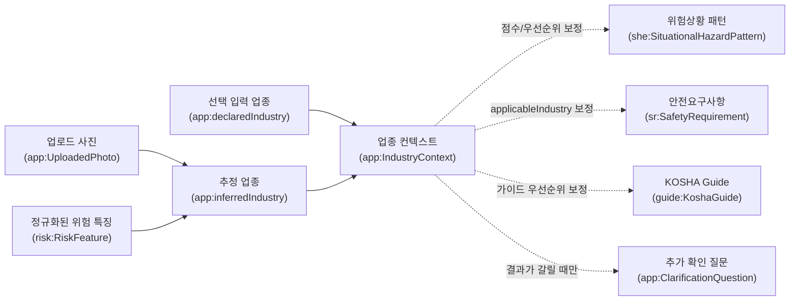

# 온톨로지 통합 구조 및 실행 흐름도

이 문서는 사진 업로드 서비스 기준의 최신 통합 구조다.

문서 기준일: 2026-05-06

현재 기준 문서는 이 파일과 루트의 각 레이어 상세도다.

검토 결과, 각 레이어 상세도 Mermaid는 현재 구조와 대체로 일치한다. 다만 통합도에는 아래 내용이 빠져 있어 이번 문서에 반영했다.

```text
1. 법령 구조: LegalStructure / Part / Chapter / Section / Subsection
2. 법령 유형과 모달리티/주체역할 열거값
3. SR의 sr:addressesFeature와 구체 위험 관계 병행 구조
4. Guide의 DomainTerm, GuideInterLink, CI 위험 특징 색인
5. PenaltyRule 중심 구조의 SanctionInstance, CriminalSanction, AdministrativeFine, penaltyDescription, severityScore
6. PenaltyPath가 TTL/OWL 클래스가 아니라 백엔드 응답 모델이라는 점
7. app 실행 레이어와 PostgreSQL 물질화 저장소의 역할
```

핵심 흐름은 다음과 같다.

```text
사진 관찰사실
→ risk:RiskFeature 후보 정규화
→ 재사용 가능한 she:SituationalHazardPattern 매칭
→ SR로 위반 가능성 판단
→ KOSHA Guide / WorkProcess로 개선 절차 구성
→ PenaltyRule / PenaltyCondition을 3개 벌칙 안내 경로로 그룹화
→ 사업주용 안내 생성
```

설계 원칙은 네 가지다.

- `risk:`는 위험 지식의 공통 추상 계층이다. `haz:`, `agent:`, `ctx:`는 `risk:RiskFeature` 아래의 역할별 분류 어휘다.
- `she:`는 사진별 실행 데이터가 아니라 반복 재사용되는 위험상황 패턴과 시각 트리거를 담는다.
- `KOSHA Guide`와 `WorkProcess`를 개선조치의 중심으로 두고, `ChecklistItem`은 즉시 조치 후보이자 보조 단서/검색 색인으로 사용한다.
- 원시 사진, bbox, LLM 원문, 중간 응답은 RDF가 아니라 DB/Object Storage에 저장하고, 검증된 요약 결과만 `app:` 레이어에 남긴다.

## 통합 구조도

```mermaid
---
config:
  layout: elk
---
flowchart TB
    %% LEGEND
    subgraph Legend["범례 (Legend)"]
      direction TB
      AppLegend["<b style='color:#d97706;'>app/runtime</b><br/>사진 분석 실행 결과와 응답 모델"]
      RiskLegend["<b style='color:#b91c1c;'>risk/haz/agent/ctx/she</b><br/>위험 특징, 위험상황 패턴, 시각 트리거"]
      LawLegend["<b style='color:#4f46e5;'>law/core</b><br/>법령 조문, 규범진술문, 역할/모달리티"]
      SRLegend["<b style='color:#0369a1;'>sr</b><br/>서비스 검색용 안전요구사항"]
      GuideLegend["<b style='color:#7e22ce;'>guide</b><br/>KOSHA Guide, 절차, 체크리스트, 색인"]
      PenLegend["<b style='color:#7c2d12;'>pen</b><br/>PenaltyRule, 조건, 제재, 벌칙 안내 경로"]
      RuntimeLegend["<b style='color:#64748b;'>점선</b><br/>runtime / inverse / propertyChain / schema-only / data-use 보조 관계"]
      StageLegend["<b>단계 번호 · 의미 · 역할</b><br/><span style='font-size:10px;'>0 입력: 사진/분석 건 생성<br/>1 해석: Vision LLM 관찰 추출<br/>2 정규화: risk:RiskFeature 변환<br/>3 매칭: SHE 위험상황 패턴 후보<br/>4A 법령: 조문/규범진술문/역할<br/>4B SR: 서비스용 안전요구사항<br/>5 Guide: 개선 절차와 즉시 조치 단서<br/>6 벌칙: PenaltyRule/조건/제재<br/>7 판정: 위험·조치·벌칙 노출 구성<br/>8 안내: 사업주 화면 생성<br/>9 개선: 로그/피드백으로 패턴 보강</span>"]
      EdgeNoLegend["<span style='font-size:10px;'>※ R01/L01/S01 같은 번호는 실행 순서가 아니라 상세도 관계선 식별용 번호</span>"]
    end

    %% APP INPUT / RESULT
    subgraph APP["0-1. 사진 입력과 실행 결과 요약 (app/runtime)"]
      direction TB
      User["사업주"]
      Case["분석 건<br/>(app:InspectionCase)"]
      Photo["업로드 사진<br/>(app:UploadedPhoto)"]
      RawLog["원시 실행 로그<br/>DB/Object Storage"]
      Observation["관찰 사실<br/>(app:VisualObservation)"]
      VisualCue["시각 단서<br/>(app:VisualCue)"]
      ObservationConfidence["관찰 신뢰도<br/>(app:confidence)<br/>기록/감사용"]
      SituationMatch["상황 매칭<br/>(app:SituationMatch)"]
      HazardFinding["위험 판단<br/>(app:HazardFinding)"]
      MatchConfidence["매칭 신뢰도<br/>(app:matchConfidence)"]
    end

    User -->|"사진 업로드"| Case
    Case -->|"app:hasPhoto"| Photo
    Photo -->|"원본/중간 로그"| RawLog
    Photo -->|"Vision LLM 해석"| Observation
    Observation -->|"app:hasVisualCue"| VisualCue
    Observation -.->|"app:confidence"| ObservationConfidence
    SituationMatch -->|"app:matchConfidence"| MatchConfidence
    HazardFinding -->|"app:hasSituationMatch"| SituationMatch

    %% RISK / SHE
    subgraph RISK["2-3. 위험 지식 공통 계층과 SHE 패턴"]
      direction TB
      RiskFeature["위험 특징<br/>(risk:RiskFeature)"]
      RiskPattern["위험 패턴<br/>(risk:RiskPattern)"]

      subgraph FEATURE["risk:RiskFeature 하위 분류 어휘"]
        direction TB
        Hazard["위험 유형<br/>(haz:Hazard)"]
        AccidentType["사고 유형<br/>(haz:AccidentType)"]
        HazardousAgent["유해 인자<br/>(agent:HazardousAgent)"]
        WorkContext["작업 맥락<br/>(ctx:WorkContext)"]
        WorkActivity["작업 활동<br/>(ctx:WorkActivity)"]
        PPEState["보호구 상태<br/>(ctx:PPEState)"]
        Environment["환경 요인<br/>(ctx:EnvironmentalFactor)"]
        AgentState["작업자 상태<br/>(ctx:AgentState)"]
        TemporalStage["시간 단계<br/>(ctx:TemporalStage)"]
      end

      subgraph SHE["risk 하위 위험상황 패턴 도메인 (she:)"]
        direction TB
        SHEPattern["위험상황 패턴<br/>(she:SituationalHazardPattern)"]
        VisualTrigger["시각 트리거<br/>(she:VisualTrigger)"]
        TriggerText["트리거 문구<br/>(she:triggerText)"]
        TriggerPattern["트리거 패턴<br/>(she:triggerPattern)<br/>schema-only/data 0"]
        ValidPeriod["유효기간<br/>(she:validFrom / she:validUntil)<br/>schema-only/data 0"]
      end
    end

    Hazard -.->|"rdfs:subClassOf"| RiskFeature
    AccidentType -.->|"rdfs:subClassOf"| RiskFeature
    HazardousAgent -.->|"rdfs:subClassOf"| RiskFeature
    WorkContext -.->|"rdfs:subClassOf"| RiskFeature
    WorkActivity -.->|"rdfs:subClassOf"| RiskFeature
    PPEState -.->|"rdfs:subClassOf"| RiskFeature
    Environment -.->|"rdfs:subClassOf"| RiskFeature
    AgentState -.->|"rdfs:subClassOf"| RiskFeature
    TemporalStage -.->|"rdfs:subClassOf"| RiskFeature
    SHEPattern -.->|"rdfs:subClassOf"| RiskPattern

    VisualCue -->|"app:mappedTo"| RiskFeature
    VisualCue -.->|"visual trigger match"| VisualTrigger
    VisualCue -->|"pattern match"| SHEPattern
    SHEPattern -->|"risk:hasFeature<br/>물질화된 통합 검색 관계"| RiskFeature
    SHEPattern -->|"she:hasAccidentType<br/>subPropertyOf risk:hasFeature"| AccidentType
    SHEPattern -->|"she:hasHazardousAgent<br/>subPropertyOf risk:hasFeature"| HazardousAgent
    SHEPattern -->|"she:hasWorkContext<br/>subPropertyOf risk:hasFeature"| WorkContext
    SHEPattern -->|"she:hasWorkActivity<br/>subPropertyOf risk:hasFeature"| WorkActivity
    SHEPattern -->|"she:hasPPEState<br/>subPropertyOf risk:hasFeature"| PPEState
    SHEPattern -->|"she:hasEnvironmental<br/>subPropertyOf risk:hasFeature"| Environment
    SHEPattern -->|"she:hasAgentState<br/>subPropertyOf risk:hasFeature"| AgentState
    SHEPattern -->|"she:hasTemporalStage<br/>subPropertyOf risk:hasFeature"| TemporalStage
    SHEPattern -->|"she:hasVisualTrigger"| VisualTrigger
    VisualTrigger -->|"she:triggerText"| TriggerText
    VisualTrigger -.->|"she:triggerPattern<br/>schema-only/data 0"| TriggerPattern
    SHEPattern -.->|"she:validFrom / she:validUntil<br/>schema/data 0"| ValidPeriod
    SHEPattern -.->|"she:supersededBy<br/>schema/data 0"| SHEPattern
    SituationMatch -->|"app:matchesSituation"| SHEPattern

    %% LAW / CORE
    subgraph LAW["4A. 법령 레이어 (law/core)"]
      direction TB
      LegalEntity["법령 엔티티<br/>(law:LegalEntity)"]
      Article["조문<br/>(law:Article)"]
      LawType["법령 유형<br/>(law:LawType)"]
      LawTypeValues["법령 유형 값<br/>(RULE / OSHA / DECREE / ENFORCE / SADA)"]
      NormStatement["규범 진술문<br/>(law:NormStatement)"]
      LegalStructure["법령 구조<br/>(law:LegalStructure)"]
      Part["편<br/>(law:Part)"]
      Chapter["장<br/>(law:Chapter)"]
      Section["절<br/>(law:Section)"]
      Subsection["관<br/>(law:Subsection)"]
      Modality["모달리티<br/>(core:Modality)"]
      ModalityValues["모달리티 값<br/>(Obligation / Prohibition / Permission / Exemption / Definition)"]
      SubjectRole["주체 역할<br/>(core:SubjectRole)"]
      SubjectRoleSubtypes["역할 하위분류<br/>(DutyHolder / ProtectedPerson / RegulatoryAuthority)"]
    end

    Article -.->|"rdfs:subClassOf"| LegalEntity
    NormStatement -.->|"rdfs:subClassOf"| LegalEntity
    Part -.->|"rdfs:subClassOf"| LegalStructure
    Chapter -.->|"rdfs:subClassOf"| LegalStructure
    Section -.->|"rdfs:subClassOf"| LegalStructure
    Subsection -.->|"rdfs:subClassOf"| LegalStructure
    LawTypeValues -.->|"rdf:type"| LawType
    ModalityValues -.->|"rdf:type"| Modality
    SubjectRoleSubtypes -.->|"rdf:type / rdfs:subClassOf"| SubjectRole
    Subsection -->|"law:hasParentStructure<br/>data-use"| Section
    Section -->|"law:hasParentStructure<br/>data-use"| Chapter
    Chapter -->|"law:hasParentStructure<br/>data-use"| Part
    Article -->|"law:belongsToPart<br/>data-use"| Part
    Article -->|"law:belongsToChapter<br/>data-use"| Chapter
    Article -->|"law:belongsToSection<br/>data-use"| Section
    Article -->|"law:belongsToSubsection<br/>data-use"| Subsection
    Article -->|"law:hasLawType<br/>FunctionalProperty"| LawType
    Article -.->|"law:hasNormStatement<br/>inverseOf hasSourceArticle"| NormStatement
    NormStatement -->|"law:hasSourceArticle<br/>FunctionalProperty"| Article
    NormStatement -->|"law:hasModality<br/>FunctionalProperty"| Modality
    NormStatement -->|"law:hasSubjectRole"| SubjectRole
    NormStatement -->|"law:modifies<br/>AsymmetricProperty"| NormStatement

    %% SR
    subgraph SR_LAYER["4B. 안전요구사항 레이어 (sr)"]
      direction TB
      SR["안전요구사항<br/>(sr:SafetyRequirement)"]
      RequirementType["요구사항 유형<br/>(sr:RequirementType)"]
      RequirementTypeValues["요구사항 유형 값<br/>Procedural / PhysicalProtection / EquipmentStandard / ManagementSystem / Environmental / PPERequirement / EmergencyResponse / Training"]
      BindingForce["구속력<br/>(core:BindingForce)"]
      BindingForceValues["구속력 값<br/>(Mandatory / Recommended / Informative)"]
      AddressesFeature["위험 특징 연결<br/>(sr:addressesFeature)"]
    end

    RequirementTypeValues -.->|"rdf:type"| RequirementType
    BindingForceValues -.->|"rdf:type"| BindingForce
    AddressesFeature -.->|"rdfs:range"| RiskFeature
    SR -->|"sr:derivedFromNS"| NormStatement
    SR -->|"sr:appliesToArticle<br/>propertyChain 가능"| Article
    SR -->|"sr:hasRequirementType<br/>FunctionalProperty, data-use"| RequirementType
    SR -->|"sr:hasBindingForce<br/>FunctionalProperty, data-use"| BindingForce
    SR -->|"sr:addressesFeature<br/>물질화된 통합 검색 관계"| RiskFeature
    SR -->|"sr:addressesHazard<br/>subPropertyOf addressesFeature"| Hazard
    SR -->|"sr:addressesAccidentType<br/>subPropertyOf addressesFeature"| AccidentType
    SR -->|"sr:addressesAgent<br/>subPropertyOf addressesFeature"| HazardousAgent
    SR -->|"sr:inWorkContext<br/>subPropertyOf addressesFeature"| WorkContext
    SHEPattern -->|"she:appliesSR"| SR
    SR -.->|"sr:violatedIn<br/>inverseOf she:appliesSR"| SHEPattern

    %% GUIDE
    subgraph GUIDE["5. KOSHA Guide 레이어 (guide)"]
      direction TB
      KoshaGuide["KOSHA Guide<br/>(guide:KoshaGuide)"]
      ChecklistItem["점검항목<br/>(guide:ChecklistItem)<br/>즉시 조치/보조 단서/검색 색인"]
      WorkProcess["작업 프로세스<br/>(guide:WorkProcess)<br/>표준 절차/흐름"]
      DomainTerm["도메인 용어<br/>(guide:DomainTerm)"]
      EquipmentSpec["장비 규격<br/>(guide:EquipmentSpec)"]
      DocumentRequirement["문서 요구사항<br/>(guide:DocumentRequirement)"]
      GuideInterLink["가이드 참조 링크<br/>(guide:GuideInterLink)<br/>data-use/schema 누락"]
    end

    KoshaGuide -->|"guide:hasChecklistItem"| ChecklistItem
    KoshaGuide -->|"guide:hasWorkProcess"| WorkProcess
    KoshaGuide -->|"guide:hasDomainTerm"| DomainTerm
    KoshaGuide -->|"guide:hasEquipmentSpec"| EquipmentSpec
    KoshaGuide -->|"guide:hasDocumentRequirement"| DocumentRequirement
    KoshaGuide -->|"guide:referencesGuide"| KoshaGuide
    ChecklistItem -->|"guide:basedOnSR"| SR
    WorkProcess -->|"guide:relatedSR"| SR
    EquipmentSpec -->|"guide:specForSR"| SR
    DocumentRequirement -->|"guide:docForSR"| SR
    DomainTerm -.->|"guide:termForSR<br/>schema-only/data 0"| SR
    DomainTerm -.->|"guide:termNameForSR<br/>data-use/schema 누락"| SR
    ChecklistItem -->|"guide:ciAddressesAccidentType"| AccidentType
    ChecklistItem -->|"guide:ciAddressesAgent"| HazardousAgent
    ChecklistItem -->|"guide:ciInWorkContext"| WorkContext
    SHEPattern -->|"she:relatedChecklistCue"| ChecklistItem
    SHEPattern -.->|"she:relatedGuide<br/>schema/data 0"| KoshaGuide
    SHEPattern -.->|"she:appliesCI<br/>schema/data 0"| ChecklistItem
    SHEPattern -.->|"she:appliesPenalty<br/>schema/data 0"| PenaltyRule
    GuideInterLink -.->|"linkSource / linkTarget / referenceText<br/>data-use"| KoshaGuide

    %% PENALTY
    subgraph PEN["6. 벌칙 레이어 (pen/runtime)"]
      direction TB
      PenaltyRule["벌칙 적용 규칙<br/>(pen:PenaltyRule)"]
      PenaltyCondition["벌칙 경로 분류 근거<br/>(pen:PenaltyCondition)"]
      AccidentOutcome["사고 결과<br/>(pen:AccidentOutcome)"]
      SimpleViolation["단순 위반<br/>(pen:SimpleViolation)"]
      Death["사망<br/>(pen:Death)"]
      SeriousAccident["중대재해<br/>(pen:SeriousAccident)"]
      SanctionType["제재 유형<br/>(pen:SanctionType)"]
      CriminalSanction["형사벌<br/>(pen:CriminalSanction)"]
      AdministrativeFine["과태료<br/>(pen:AdministrativeFine)<br/>현재 인스턴스 0건"]
      SanctionInstance["제재 인스턴스<br/>(pen:Sanction_*)"]
      PenaltyBasisText["벌칙 근거 문구<br/>(pen:penaltyBasisText)"]
      PenaltyDescription["벌칙 내용<br/>(pen:penaltyDescription)"]
      SeverityScore["심각도 점수<br/>(pen:severityScore)"]
      PenaltyPath["벌칙 안내 경로<br/>(PenaltyPath 응답 모델)<br/>일반 위반·일반 산재 / 사망 / 중대재해"]
    end

    PenaltyRule -.->|"rdfs:subClassOf"| LegalEntity
    CriminalSanction -.->|"rdfs:subClassOf"| SanctionType
    AdministrativeFine -.->|"rdfs:subClassOf<br/>정의만 있음"| SanctionType
    SimpleViolation -.->|"rdf:type"| AccidentOutcome
    Death -.->|"rdf:type"| AccidentOutcome
    SeriousAccident -.->|"rdf:type"| AccidentOutcome
    SanctionInstance -.->|"rdf:type<br/>현재는 CriminalSanction 인스턴스"| CriminalSanction
    NormStatement -.->|"pen:hasPenaltyRule<br/>inverseOf violatedNorm"| PenaltyRule
    PenaltyRule -->|"pen:violatedNorm"| NormStatement
    PenaltyRule -->|"pen:violatedArticle"| Article
    PenaltyRule -.->|"pen:delegatedFrom<br/>optional/data-use"| Article
    PenaltyRule -->|"pen:penaltyArticle"| Article
    PenaltyRule -->|"pen:hasCondition<br/>FunctionalProperty"| PenaltyCondition
    PenaltyCondition -->|"pen:requiresSubjectRole"| SubjectRole
    PenaltyCondition -->|"pen:requiresAccidentOutcome"| AccidentOutcome
    AccidentOutcome -.->|"표시 경로 그룹화<br/>runtime"| PenaltyPath
    PenaltyRule -->|"pen:hasSanction<br/>range SanctionType"| SanctionInstance
    PenaltyRule -->|"pen:penaltyBasisText"| PenaltyBasisText
    SanctionInstance -->|"pen:penaltyDescription"| PenaltyDescription
    SanctionInstance -->|"pen:severityScore"| SeverityScore

    %% DECISION / ACTION
    subgraph DECISION["7-8. 판정, 조치, 사업주 안내 (app/runtime)"]
      direction TB
      FindingStatus["판정 상태<br/>(confirmed / suspected / needs_clarification / not_applicable)"]
      EvidenceStrength["증거 강도<br/>(high / medium / low)"]
      CorrectiveAction["개선 조치<br/>(app:CorrectiveAction)"]
      ActionRecommendation["조치 추천 항목<br/>(ActionRecommendation 응답 모델)"]
      DisplayGroup["표시 그룹<br/>immediate_action / standard_procedure / legal_basis"]
      ActionPlan["조치 계획<br/>(app:CorrectiveActionPlan)"]
      PenaltyExposure["벌칙 노출<br/>(app:PenaltyExposure)"]
      ClarificationQuestion["추가 확인 질문<br/>(app:ClarificationQuestion)"]
      AssessmentReport["사업주 안내 결과<br/>(app:AssessmentReport)"]
      ResultScreen["최종 안내 화면"]
    end

    HazardFinding -->|"app:hasFindingStatus"| FindingStatus
    HazardFinding -->|"app:hasEvidenceStrength"| EvidenceStrength
    HazardFinding -->|"app:recommendsAction"| CorrectiveAction
    HazardFinding -->|"app:hasPenaltyExposure"| PenaltyExposure
    HazardFinding -->|"app:needsClarification"| ClarificationQuestion
    HazardFinding -->|"요약 대상"| AssessmentReport
    CorrectiveAction -.->|"app:guidedBy<br/>schema, 현재 RDF data 0"| KoshaGuide
    CorrectiveAction -.->|"runtime follows process"| WorkProcess
    CorrectiveAction -.->|"app:usesChecklistCue<br/>schema, 현재 RDF data 0"| ChecklistItem
    CorrectiveAction -.->|"app:citesRequirement<br/>schema, 현재 RDF data 0"| SR
    CorrectiveAction -.->|"has recommendation"| ActionRecommendation
    ActionRecommendation -.->|"display_group"| DisplayGroup
    ActionPlan -->|"app:hasAction"| CorrectiveAction
    ActionPlan -->|"조치 계획 포함"| AssessmentReport
    PenaltyExposure -->|"possiblePenalty 후보"| PenaltyRule
    PenaltyExposure -->|"PenaltyPath 3경로 표시"| PenaltyPath
    PenaltyExposure -->|"벌칙 가능성 포함"| AssessmentReport
    ClarificationQuestion -->|"필요 시 질문 포함"| AssessmentReport
    AssessmentReport -->|"화면 표시"| ResultScreen

    SHEPattern -->|"상황 근거"| SituationMatch
    SituationMatch -->|"매칭 결과"| HazardFinding
    SR -->|"관련 SR"| HazardFinding
    ObservationConfidence -.->|"보조 기록값"| HazardFinding

    %% RUNTIME / MATERIALIZATION
    subgraph RUNTIME["서빙용 물질화 함수와 저장소"]
      direction TB
      NormalizeFeatures["normalize_features()<br/>관찰 특징 정규화"]
      ApplyRules["hazard_rule_engine.apply_rules()<br/>교차 추론/보정"]
      MatchShe["she_matcher.match_she()<br/>PG she_catalog 패턴 매칭"]
      ClassifyStatus["_classify_match_status()<br/>confirmed/candidate/context_only"]
      QuerySR["query_sr_for_facets()<br/>SHE 실패 시 SR 보조 검색"]
      GetChecklist["get_checklist_from_srs()<br/>SR → CI"]
      GetGuides["get_guides_from_srs()<br/>SR → CI → Guide"]
      BuildActions["_build_action_recommendations()<br/>즉시조치/표준절차/근거 그룹화"]
      SheCatalog["PostgreSQL she_catalog"]
      SheSRMap["she_sr_mapping"]
      SheCIMap["she_ci_mapping"]
      GuideTables["PostgreSQL guide tables<br/>kosha_guides / checklist_items / work_processes ..."]
      BootstrapShe["bootstrap_she_from_synthetic.build_candidate()"]
      ExportShe["load_she_to_fuseki.she_to_ttl_block()"]
    end

    Observation -.->|"입력"| NormalizeFeatures
    NormalizeFeatures -.->|"정규화 특징"| ApplyRules
    ApplyRules -.->|"accident/agent/context"| MatchShe
    MatchShe -.->|"JSONB broad filter + dim match"| SheCatalog
    MatchShe -.->|"상태 판정"| ClassifyStatus
    MatchShe -.->|"SR follow"| SheSRMap
    MatchShe -.->|"CI follow"| SheCIMap
    SheSRMap -.->|"applies_sr_ids"| SR
    SheCIMap -.->|"applies_ci_ids"| ChecklistItem
    ClassifyStatus -.->|"confirmed/candidate/context_only"| SituationMatch
    QuerySR -.->|"facet fallback"| SR
    GetChecklist -.->|"ci_sr_mapping"| GuideTables
    GetGuides -.->|"source_guide 집계"| GuideTables
    GetChecklist -.->|"즉시 조치 후보"| BuildActions
    GetGuides -.->|"표준 개선 절차 후보"| BuildActions
    BuildActions -.->|"ActionRecommendation 생성"| ActionRecommendation
    BootstrapShe -.->|"후보 upsert"| SheCatalog
    SheCatalog -.->|"fetch_active_she_from_pg()"| ExportShe
    ExportShe -.->|"TTL: she:has* + risk:hasFeature + appliesSR"| SHEPattern

    %% IMPROVEMENT LOOP
    subgraph IMPROVE["9. 온톨로지 개선 루프"]
      direction TB
      Candidate["SHE / VisualTrigger 후보"]
      Validator["자동 검증"]
      Review["예외 검토"]
      Approved["승인된 패턴 사전"]
    end

    RawLog -.->|"운영 로그 분석"| Candidate
    ResultScreen -.->|"사용자/검토자 피드백"| Candidate
    Candidate --> Validator
    Validator -->|"확실함"| Approved
    Validator -->|"애매함/고위험"| Review
    Review --> Approved
    Approved --> BootstrapShe

    %% STYLING
    classDef app fill:#fff7ed,stroke:#f59e0b,color:#111;
    classDef risk fill:#fef2f2,stroke:#f87171,color:#111;
    classDef feature fill:#fee2e2,stroke:#dc2626,color:#111;
    classDef she fill:#faf5ff,stroke:#c084fc,color:#111;
    classDef law fill:#eef2ff,stroke:#818cf8,color:#111;
    classDef sr fill:#f0f9ff,stroke:#38bdf8,color:#111;
    classDef guide fill:#faf5ff,stroke:#a855f7,color:#111;
    classDef penalty fill:#fff7ed,stroke:#fb923c,color:#111;
    classDef runtime fill:#f1f5f9,stroke:#64748b,color:#111;
    classDef legend fill:#fefce8,stroke:#facc15,color:#111;

    class User,Case,Photo,RawLog,Observation,VisualCue,ObservationConfidence,SituationMatch,HazardFinding,MatchConfidence,FindingStatus,EvidenceStrength,CorrectiveAction,ActionRecommendation,DisplayGroup,ActionPlan,PenaltyExposure,ClarificationQuestion,AssessmentReport,ResultScreen,Candidate,Validator,Review,Approved app;
    class RiskFeature,RiskPattern risk;
    class Hazard,AccidentType,HazardousAgent,WorkContext,WorkActivity,PPEState,Environment,AgentState,TemporalStage feature;
    class SHEPattern,VisualTrigger,TriggerText,TriggerPattern,ValidPeriod she;
    class LegalEntity,Article,LawType,LawTypeValues,NormStatement,LegalStructure,Part,Chapter,Section,Subsection,Modality,ModalityValues,SubjectRole,SubjectRoleSubtypes law;
    class SR,RequirementType,RequirementTypeValues,BindingForce,BindingForceValues,AddressesFeature sr;
    class KoshaGuide,ChecklistItem,WorkProcess,DomainTerm,EquipmentSpec,DocumentRequirement,GuideInterLink guide;
    class PenaltyRule,PenaltyCondition,AccidentOutcome,SimpleViolation,Death,SeriousAccident,SanctionType,CriminalSanction,AdministrativeFine,SanctionInstance,PenaltyBasisText,PenaltyDescription,SeverityScore,PenaltyPath penalty;
    class NormalizeFeatures,ApplyRules,MatchShe,ClassifyStatus,QuerySR,GetChecklist,GetGuides,BuildActions,SheCatalog,SheSRMap,SheCIMap,GuideTables,BootstrapShe,ExportShe runtime;
    class Legend,AppLegend,RiskLegend,LawLegend,SRLegend,GuideLegend,PenLegend,RuntimeLegend,StageLegend,EdgeNoLegend legend;
```

## 읽는 법

`VisualCue`는 사진에서 보이는 단서다. 예를 들어 “작업자가 높은 곳에 있고 난간이 보이지 않음” 같은 관찰 조각이다.

`risk:RiskFeature`는 사진 단서를 온톨로지 어휘로 정규화한 결과다. `haz:AccidentType`, `agent:HazardousAgent`, `ctx:WorkContext` 같은 구체 분류가 모두 이 계열에 속한다.

`she:SituationalHazardPattern`은 그 사진 하나에 종속된 사건이 아니라, “고소 작업 + 추락 가능성 + 보호조치 미흡”처럼 반복 재사용 가능한 위험상황 패턴이다.

`SafetyRequirement`는 실제 위반 가능성을 판단하는 기준이다. 사진 단서가 곧바로 위반이 되는 것이 아니라, `SHE Pattern -> SR -> NormStatement/Article` 경로를 통해 법령 근거와 연결된다.

`KoshaGuide`와 `WorkProcess`는 사업주에게 알려줄 개선 절차의 중심이다. `ChecklistItem`은 화면에서는 즉시 확인/즉시 조치 후보로 보여줄 수 있지만, 온톨로지 구조상 최종 조치 본체라기보다 사진 단서와 SR/Guide를 이어주는 보조 색인으로 다룬다.

`PenaltyRule`은 벌칙 후보이고, `PenaltyCondition`은 기본 화면에서 법적 책임 주체를 확정하는 조건이 아니라 벌칙 안내 경로를 나누는 최소 분류 근거다. 사진만으로 사업주/수급인, 사망, 중대재해 요건을 확정하지 않고, `SimpleViolation`은 “일반 위반 또는 일반 산재 발생 시”, `Death`는 “사망 발생 시”, `SeriousAccident`는 “중대재해 요건 충족 시”로 묶어 보여준다.

`PenaltyPath`는 TTL/OWL 클래스가 아니라 백엔드 응답 모델이다. 따라서 통합 구조도에서는 runtime 표시 경로로만 둔다.

## 업종 컨텍스트 반영

업종은 첫 화면에서 필수로 묻지 않는다. 대신 사진/텍스트에서 추론한 `app:inferredIndustry`와 사용자가 선택적으로 제공한 `app:declaredIndustry`를 함께 보관하고, SHE/SR/Guide 후보의 우선순위 보정에 사용한다. 업종에 따라 결과가 갈릴 때만 `app:ClarificationQuestion`으로 확인 질문을 만든다.



## 상세도와의 대응

각 레이어 상세도와 통합도의 대응은 다음과 같다.

| 상세도 | 통합도 반영 위치 |
|---|---|
| `온톨로지_법령레이어_상세도.md` | `4A. 법령 레이어` |
| `온톨로지_SR레이어_상세도.md` | `4B. 안전요구사항 레이어` |
| `온톨로지_위험상황레이어_상세도.md` | `2-3. 위험 지식 공통 계층과 SHE 패턴`, `서빙용 물질화 함수와 저장소` |
| `온톨로지_가이드레이어_상세도.md` | `5. KOSHA Guide 레이어`, `서빙용 물질화 함수와 저장소` |
| `온톨로지_벌칙레이어_상세도.md` | `6. 벌칙 레이어`, `7-8. 판정, 조치, 사업주 안내` |

통합도는 모든 세부 관계를 빠짐없이 펼친 ERD가 아니라, 서비스 흐름에서 필요한 주요 클래스와 관계를 한 장에 모은 지도다. 세부 인스턴스 수, schema-only 관계, data-use 관계의 정확한 상태는 각 레이어 상세도를 기준으로 확인한다.

## OHS product 구현 반영 메모

2026-05-10 기준 `OHS`는 위 통합 흐름을 기준으로 product 코드를 정리했고, root `arch-bot` monorepo snapshot에서 추적되는 일반 디렉토리다.

백엔드 흐름은 다음 책임으로 분리되어 있다.

```text
analysis_service.py
  OpenAI 호출 진입점과 기존 API 호환 래퍼

analysis_pipeline.py
  관찰 결과 → RiskFeature → SHE → SR/WorkProcess/Guide/ChecklistItem/PenaltyPath 응답 조립

risk_rule_service.py
  risk feature 보정과 규칙 기반 feature 확장

sr_lookup_service.py
  SHE 실패 또는 보조 경로에서 SR 후보 조회

guide_recommendation_service.py
  actionable SHE, SR, Guide usage profile, visual cue, industry context를 함께 사용해 즉시 조치와 Guide/WorkProcess 기반 표준 개선 절차 구성

guide_domain_profile.py
  Guide 고유 사용경계, negative boundary, procedure role, WorkProcess relevance 기반 domain mismatch 평가

penalty_path_service.py
  PenaltyRule 후보를 사업주용 3경로 PenaltyPath로 그룹화
```

프론트 결과 화면은 다음 패널 구조로 정리되어 있다.

```text
RiskOverviewPanel
ImmediateActionsPanel
GuideProcedurePanel
PenaltyPathPanel
ReasoningTracePanel
```

현재 검증 기준은 다음과 같다.

```text
accepted baseline: usage_profile11
Python compile: OK
frontend npm run build: OK
synthetic Guide v1~v10 total: 2,360
legacy obvious top Guide mismatch: 1,145
current obvious top Guide mismatch: 165
reduction: 85.59%
NO_TOP: 395
v10 SHE recall: 100.0%, FN 0, FP 0
actual response 240 status changed: 0
negative_false_positive: 10
positive_missed: 2
ambiguous_over_promoted: 5
```

남은 핵심 작업은 `SHE/SR 후보를 놓치지 않는 것`이 아니라, status-level risk inference를 넓히지 않으면서 `NO_TOP 395`와 Guide/WorkProcess 사용경계 공백을 구조적으로 보강하는 것이다.
